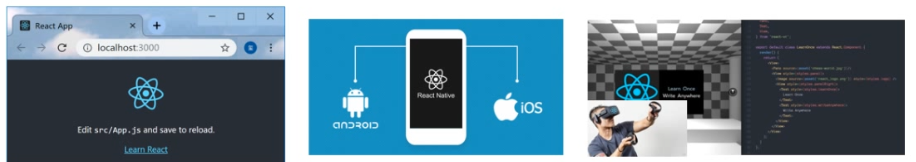

# React概述

+  [ ]   React 介绍
+  [ ]   React 特点
+  [ ]   React 脚手架（CLI）
+  [ ]   React 的基本使用

## React 介绍


**目标**：知道什么是 React

**内容**：

+ React官网
  + React 文档 (https://reactjs.org/)
  + React 中文文档(https://zh-hans.reactjs.org/)
  + 新版 React 文档（[https://beta.reactjs.org/](https://beta.reactjs.org/)）
+ React 是一个用于构建用户界面（UI，对咱们前端来说，简单理解为：HTML 页面）的 JavaScript 库  

+ React 起源于 Facebook 内部项目（News Feed，2011），后又用来架设 Instagram 的网站（2012），并于 2013 年 5 月开源（[react介绍](https://baike.baidu.com/item/react/18077599?fr=aladdin)）
+ React 是最流行的前端开发框架之一，其他：Vue、Angular 等等（[npm 下载趋势对比](https://www.npmtrends.com/angular-vs-react-vs-vue)）

**总结**：

 + React 是一个用于构建用户界面的 JavaScript 库

## React 特点

**目标**：能够说出React的三个特点

**内容**：

+ 声明式UI

  - 你只需要描述UI（HTML）看起来是什么样的，或者说：就跟写HTML一样写 React

  - React 中通过数据驱动视图的变化，当数据发生改变 React 能够高效的更新并渲染DOM

```jsx
// JSX
const dv = (
	<div className="app">
    <h1>Hello React! 动态数据: {count}</h1>
  </div>
)

// --

// 遍历数组的两种方式对比：

// 1 声明式：关注 what，不关注细节
arr.forEach(item => {
  console.log(item)
})

// 2 命令式：关注 how，关注如何一步步实现
for (let i = 0; i < arr.length; i++) {
  console.log(arr[i])
}
```

+ 基于组件

  - 组件是 React 中**最重要**的内容

  - 组件用于表示页面中的部分内容

  - 组合、复用多个组件，就可以实现完整的页面功能


+ 学习一次，随处使用

  - 使用 react/react-dom 可以开发Web应用

  - 使用 react/react-native 可以开发移动端原生安卓 和 iOS应用

  - 使用 react 可以开发VR（虚拟现实）应用（react-360）



**总结**：

- 声明式  => 关注 what 而不是 how（对应的 命令式）
- 基于组件  => 组件化
- 学习一次，随处使用  => 跨平台

从其他角度看 React 特点：

- 工资高、大厂必备（阿里、字节跳动、百度、腾讯、京东、蚂蚁金服、拼多多、美团、外企、银行等都在用）

## React 脚手架的使用

**目标**：掌握如何使用react脚手架创建项目

**内容**：

- `create react app`（简称：CRA）是 React 官方团队出的一个构建 React 应用的脚手架工具
- 命令：`npx create-react-app react-basic`（react-basic 表示项目名称，可以修改）
- 启动项目：`yarn start` or `npm start`

+ npx 是 npm v5.2 版本新添加的命令，用来简化 npm 中工具包的使用
  - 原始：1 全局安装 `npm i -g create-react-app` 2 在通过脚手架的命令来创建 React 项目
  - 现在：npx 调用最新的 create-react-app 直接创建 React 项目

## React 的基本使用

**目标**：能够使用 React 渲染一个 h1 元素并展示到页面中

**内容**：

1. 导入`react`和`react-dom` 
2. 创建 React 元素
3. 渲染 React 元素到页面中

**核心代码**：

```jsx
// 导入react和react-dom
import React from 'react'
import { createRoot } from 'react-dom/client'

// 创建元素
const title = React.createElement('h1', null, 'hello react')

// 渲染react元素
const root = createRoot(document.getElementById('root'))
root.render(title)
```

**说明**：

- React 脚手架已经安装了 react 和 react-dom 的依赖包，不需要额外安装依赖包

**练习**：

1. 使用 React，创建以下结构（1）

```jsx
<div id="box" class="demo">这是一个react案例</div>

React.createElement('div', { id: 'box', class: 'demo' }, '这是一个react案例')
```

2. 创建结构（2）

```jsx
<ul class="list">
  <li>香蕉</li>
  <li>橘子</li>
  <li>苹果</li>
</ul>

React.createElement(
  'ul',
  { className: 'list' },
  // 元素节点，值也是 React.createElement() 创建的元素
  React.createElement('li', null, '香蕉'),
  React.createElement('li', null, '橘子'),
  React.createElement('li', null, '苹果')
)
```

## React 插件的安装

**目标**：安装 Chrome 浏览器插件`react-devtools`

**内容**：安装后，只会在使用了 React 的网站中出现

- [Chrome 浏览器插件下载](https://chrome.zzzmh.cn/#/index)

