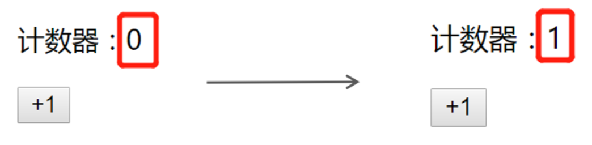

# 组件基础

+ [ ] React 组件介绍
+ [ ] React 组件的两种创建方式
+ [ ] 事件绑定
+ [ ] 组件的状态
+ [ ] 表单处理

反馈：

1 为什么不能 使用 map进行循环 渲染时 不能使用{}对象的形式？ 记得之前都是xxx.map(item=> {}) 之前是这样子写的 

```jsx
arr.map(item => {
  return <li></li>
})
// 回调函数
const fn = item => {
  return <li></li>
}
arr.map(fn)

arr.map(item => <li></li>)

// ES6 箭头函数的简化，省略 return
const fn1 = item => <li></li>
arr.map(fn1)
```

2 为什么在表达式中可以调用()函数却不能接渲染？

```jsx
const fn = () => 1

const res = fn() // res => 1

const el = <div>{fn()}</div> // 相当于 => const el = <div>{1}</div>
      
// 对于函数调用来说，不管函数有没有返回值，该函数是一定会有一个结果
// 有返回值，结果就是函数的返回值
// 没有返回值，就是默认值：undefined
// 因此，函数调用可以在 {} 中使用


// JSX 中无法直接渲染函数，以下内容会报错
const el = <div>{fn}</div>
// 可以手动将函数转化为 string 类型，然后，就可以渲染了
const el1 = <div>{fn.toString()}</div>
```

## 组件基本介绍                                                                                                                                                                                                                                                                                                                                                                                                                                

**目标**：能够知道 React 组件的意义

**内容**：

+ 组件是 React 开发（现代前端开发）中最重要的内容
+ 组件允许你将 UI 拆分为独立、可复用的部分，每个部分都可以独立的思考
+ 组合多个组件（组装乐高积木）实现完整的页面功能
+ 特点：独立、可复用、可组合
+ 组件包含三部分：HTML/CSS/JS


## 创建组件的两种方式

### 函数组件

**目标：**掌握react中使用函数创建组件

**内容**：

+ 函数组件：使用JS的函数或者箭头函数创建的组件
  + 使用 JS 的函数(或箭头函数)创建的组件，叫做`函数组件`	
  + 约定1：**函数名称必须以大写字母开头**，React 据此区分组件和普通的 HTML标签
  + 约定2：**函数组件必须有返回值**，表示该组件的 UI 结构；如果不需要渲染任何内容，则返回 `null`

**核心代码**：

创建函数组件：

```jsx
// 使用普通函数创建组件：
function Hello() {
  return <div>这是我的第一个函数组件!</div>
}
function Button() {
  return <button>按钮</button>
}

// 使用箭头函数创建组件：
const Hello = () => <div>这是我的第一个函数组件!</div>
```

渲染组件：
+ 组件就像 HTML 标签一样可以被渲染到页面中。组件表示的是一段结构内容，对于函数组件来说，渲染的内容是函数返回值对应的内容
+ 使用函数名称作为组件标签名称

```jsx
// 使用 双标签 渲染组件：
root.render(<Hello></Hello>)

// 使用 单标签 渲染组件：
root.render(<Hello />)
```

**小结**：

1. 在react中可以使用函数或者箭头函数创建组件
2. 组件的首字母必须大写

### 类组件

**目标**：使用ES6的class语法创建组件

**内容**：

- 使用 ES6 的 class 创建的组件，叫做类（class）组件
- 约定1：**类名称也必须以大写字母开头**
- 约定2：类组件应该继承 React.Component 父类，从而使用父类中提供的方法或属性
- 约定3：类组件必须提供 render 方法
- 约定4：render 方法必须有返回值，表示该组件的 UI 结构
- 注意：工作中主要使用 **函数组件+hooks** 进行开发，这也是 React 最新的组件开发模式，class 组件使用越来越少了

**核心代码**：

1. 创建组件

```jsx
// 方式一：导入 React
import React from 'react'
class Hello extends React.Component {
  render() {
    return <div>Hello Class Component!</div> 
  }
}


// 方式二：只导入 Component
import { Component } from 'react'
class Hello extends Component {
  render() {
    return <div>Hello Class Component!</div> 
  }
}
```

2. 渲染组件

```jsx
root.render(<Hello />)
```

## 事件处理

### 注册事件

**目标**：能够给按钮绑定点击事件

**内容**：

- React 注册事件与 HTML 中注册事件的语法类似

- 语法： `on+事件名={事件处理程序}`，比如，`onClick={handleClick}`

- 注意：*React事件采用驼峰命名法*，比如，`onMouseEnter`、 `onClick`

**核心代码**：

```jsx
const App = () => {
  const handleClick = () => {
    console.log('点击事件触发')
  }
  
	return (
    <div>
      <button onClick={handleClick}>点我</button>
    </div>
  )
}
```

### 事件对象

**目标**：掌握注册事件时如何处理事件对象

**内容**：

+ 可以通过事件处理程序的参数获取到事件对象
+ 注意：React 中的事件对象是 React 内部处理后的事件对象，一般称为：SyntheticBaseEvent 合成事件对象。用法与 DOM 原生的事件对象用法基本一致


```jsx
const handleClick = e => {
  e.preventDefault()
  console.log('事件对象', e)
}

<a onClick={handleClick}>点我，不会跳转页面</a>
```

## 组件的状态

**目标**：能够说出组件状态的作用

**内容**：

**状态（`state`）**即数据（类比，Vue 中的 `data`），是组件内部的可变数据

Web 应用是可交互的，比如，点击计数器+1按钮，计数器的数字会增加1。这时候，就需要使用**状态（state）**来展示并更改屏幕上的内容

React 组件会“记住”这个数据（比如，计数器案例中的数值），在 React 中，这种特定于组件的内存称为**状态**（[State: A Component's Memory](https://beta.reactjs.org/learn/state-a-components-memory)）



## 状态工厂 - useState Hook

### 基本使用

**目标**：能够使用`useState`为函数组件提供状态

**内容：**

+ 一个 Hook 就是一个特殊的函数，让你在函数组件中获取状态等 React 特性
  + 从名称上看，Hook 都以` use `开头`useXxx`

- `useState`使用场景：当你想要在**函数组件中，使用组件状态时**，就要使用 **useState** Hook 了
- `useState`作用：为函数组件提供状态（state）

```js
import { useState } from 'react'

// 参数：状态初始值，
// 返回值：stateArray 是一个数组
const stateArray = useState(0)

// 索引 0 表示：状态值（state）
const state = stateArray[0]
// 索引 1 表示：修改状态的函数（setState）
const setState = stateArray[1]
```

- 注意：此处的状态可以是任意值（比如，数值、字符串等）

**步骤**：

1. 导入 `useState` hook
2. 调用 `useState` 函数，并传入状态的初始值
3. 从 `useState` 函数的返回值中，拿到状态和修改状态的函数
4. 在 JSX 中展示状态
5. 在按钮的点击事件中调用修改状态的函数，来更新状态

**核心代码**：

```jsx
import { useState } from 'react'

const Count = () => {  
  const stateArray = useState(0)

  const state = stateArray[0]
  const setState = stateArray[1]

  return (
    <div>
      {/* 展示状态值 */}
      <h1>状态为：{state}</h1>
      {/* 点击按钮，让状态值 +1 */}
      <button onClick={() => setState(state + 1)}>+1</button>
    </div>
  )
}
```

### 使用数组解构简化

**目标：**能够使用数组解构简化useState的使用

**内容**：

获取数组中的元素：

1. 原始方式：索引访问

```js
const arr = ['aaa', 'bbb']

const a = arr[0]  // 获取索引为 0 的元素
const b = arr[1]  // 获取索引为 1 的元素
```

2. 简化方式：数组解构

```js
const arr = ['aaa', 'bbb']

// 此处的 a 和 b 都是变量，分别获取到对应索引的数组元素
const [a, b] = arr
// a => arr[0]
// b => arr[1]

// 解构出来的名称，可以是任意变量名
const [state, setState] = arr
```

使用数组解构简化 `useState` 的使用：

```jsx
import { useState } from 'react'

const Count = () => {
  // 解构：
  const [count, setCount] = useState(0)

  return (
    <div>
      <h1>计数器：{state}</h1>
      <button onClick={() => setState(state + 1)}>+1</button>
    </div>
  )
}
```

约定：**修改状态的函数名称以 set 开头，后面跟上状态的名称**

根据不同的功能，可以在解构时起不同的名称：

```js
// 解构出来的名称可以是任意名称，比如：

const [state, setState] = useState(0)
const [age, setAge] = useState(0)
const [count, setCount] = useState(0)
```

- 注意：多次调用 useState 得到的多个状态和修改状态的函数之间不会相互影响

### 状态的读取和修改

**目标**：能够在函数组件中获取和修改状态

**内容：**

状态的使用：1 读取状态 2 修改状态

1. 读取状态：`useState` 提供的状态，是函数内部的局部变量，可以在函数内的任意位置使用

```jsx
const Counter = () => {
  const [user, setUser] = useState({ name: 'jack', age: 18 })
  
  return (
  	<div>
    	<p>姓名：{user.name}</p>
			<p>年龄：{user.age}</p>
    </div>
  )
}
```

2. 修改状态：

   - `setCount(newValue)` 是一个函数，参数表示：**新的状态值**

   - 调用该函数后，将**使用新的状态值`替换`旧值**
   - 修改状态后，因为状态发生了改变，所以，该组件会重新渲染

```jsx
const Counter = () => {
  const [user, setUser] = useState({ name: 'jack', age: 18 })
  
  const onAgeAdd = () => {
    setUser({
      ...user,
      age: user.age + 1
    })
  }
  
  return (
  	<div>
    	<p>姓名：{user.name}</p>
			<p>年龄：{user.age}</p>
     	<button onClick={onAgeAdd}>年龄+1</button>
    </div>
  )
}
```

**总结**：

1. 修改状态的时候，**新的状态值会替换旧的状态**

### 组件的更新过程

**目标：**能够说出使用功能`useState`之后，组件的更新过程

**内容：**

函数组件使用 **useState** hook 后的执行过程，以及状态值的变化： 

- 组件第一次渲染：
  1. 从头开始执行该组件中的代码逻辑
  2. 调用 `useState(0)` 将传入的参数作为状态初始值，即：0
  3. 渲染组件，此时，获取到的状态 count 值为： 0

- 组件第二次渲染：
  1. 点击按钮，调用 `setCount(count + 1)` 修改状态，因为状态发生改变，所以，该组件会重新渲染
  2. 组件重新渲染时，会再次执行该组件中的代码逻辑
  3. 再次调用 `useState(0)`，此时 **React 内部会拿到最新的状态值**而非初始值，比如，该案例中最新的状态值为 1
  4. 再次渲染组件，此时，获取到的状态 count 值为：1

注意：**useState 的初始值(参数)只会在组件第一次渲染时生效**。

也就是说，以后的每次渲染，useState 获取到都是最新的状态值。React 组件会记住每次最新的状态值

**核心代码**：

```jsx
import { useState } from 'react'

const Count = () => {
  const [count, setCount] = useState(0)

  return (
    <div>
      <h1>计数器：{count}</h1>
      <button onClick={() => setCount(count + 1)}>+1</button>
    </div>
  )
}
```

### 使用规则

**目标：**能够为函数组件提供多个状态

**内容：**

+ 如何为函数组件提供多个状态？

  + 调用 `useState` Hook 多次即可，每调用一次 useState Hook 可以提供一个状态
  + `useState` Hook 多次调用返回的 [state, setState]，相互之间，互不影响

+ useState 等 Hook 的使用规则：

  + **React Hooks 只能直接出现在 函数组件 中**
  + **React Hooks 不能嵌套在 if/for/其他函数 中**
  + 原理：React 是按照 Hooks 的调用顺序来识别每一个 Hook，如果每次调用的顺序不同，导致 React 无法知道是哪一个 Hook
+ 可以通过开发者工具进行查看组件的 hooks：


## 状态不可变

**目标：**理解组件状态不可变

**内容：**

状态不可变指的是：**不要直接修改状态的值**，而要基于当前状态创建新的状态值

**核心代码**：


```js
const [state, setState] = useState({
  count: 0,
  list: [1, 2, 3],
  person: {
    name: 'jack',
    age: 18
  }
})

// 【不推荐】直接修改当前值的操作：
state.count++
++state.count
state.count += 1
state.count = 1
// 只要是数组中直接修改当前数组的方法都不能用！
state.list.push(123)
// 直接修改对象的 name 属性
state.person.name = 'rose'

// ---

// 【推荐】不是直接修改当前值，而是创建新值的操作：

const newList = [...list]
// 可以对新数组，进行 push
newList.push(123123)

// const newList = [...list, 123]

setState({
  count: state.count + 1,
  // 创建新的数组
  list: [...state.list, 123],
  person: {
    ...state.person,
    // 要修改的属性，会覆盖原来的属性，这样，就可以达到修改对象中属性的目的了
    name: 'rose'
  }
})
```

## 表单处理

### 受控组件

**目标：**能够使用受控组件的方式获取文本框的值

**内容**：

+ HTML中表单元素是可输入的，即表单元素维护着自己的可变状态（value）
+ 但是在react中，可变状态通常是保存在`state`中的，并且要求状态只能通过`setState`进行修改
+ React中将state中的数据与表单元素的value值绑定到了一起，**由state的值来控制表单元素的值**
+ 受控组件：**value值受到了react状态控制的表单元素** 

**核心代码：**

```jsx
const App = () => {
  const [value, setValue] = useState('')
  
  const handleChange = e => {
    setValue(e.target.value)
  }
  
  return (
    <div>
      <input type="text" value={value} onChange={e => setValue(e.target.value)} />
    </div>
  )
}
```

**总结**：

1. 使用受控组件的方式处理表单元素后，状态的值就是表单元素的值。即：想要操作表单元素的值，只需要操作对应的状态即可

### useRef-操作DOM

**目标：**能够使用useRef操作DOM

**内容：** 

使用场景：在 React 中进行 DOM 操作时，用来获取 DOM

作用：**返回一个带有 current 属性的可变对象，通过该对象就可以进行 DOM 操作了。**

```jsx
// inputRef => { current }
const inputRef = useRef(null)
```

解释：

+ 参数：在获取 DOM 时，一般都设置为 null（获取 DOM 对象时，如果拿不到 DOM 对象，此时，获取到的值就是 null）
+ 返回值：包含 current 属性的对象

+ 注意：只要在 React 中进行 DOM 操作，都可以通过 useRef Hook 来获取 DOM（比如，获取 DOM 的宽高等）

+ 注意：useRef不仅仅可以用于操作DOM，还可以操作组件

**核心代码：**

```JSX
import { useRef } from 'react'

const App = () => {
  // 1 使用useRef能够创建一个ref对象
  const inputRef = useRef(null)

  const add = () => {
    // 3 通过 inputRef.current 来访问对应的 DOM
    console.log(inputRef.current.value)
    inputRef.current.focus()
  }
  
  return (
    <section className="todoapp">
      {/* 2 将 ref 对象设置为 input 的 ref 属性值。目的：将 ref 对象关联到 input 对应的 DOM 对象上 */}
      <input type="text" placeholder="请输入内容" ref={inputRef} />
      <button onClick={add}>添加</button>
    </section>
  )
}

export default App
```

### 非受控组件

**目标：**使用 useRef hook 获取表单元素的值

**内容**：

- 受控组件是通过 React 组件的状态来控制表单元素的值
- 非受控组件是通过**手动操作 DOM 的**方式来控制
- 此时，需要用到一个新的概念：`ref`，用来在 React 中获取 DOM 元素

**核心代码**：

```jsx
// 1 导入 createRef 函数（ 用来创建 ref 对象 ）
import { useRef } from 'react'

const App = () => {
  // 2 创建 ref 对象
  const txtRef = useRef(null)
  
  const handleClick = () => {
    // 文本框对应的 DOM 元素
    // console.log(txtRef.current)

    // 4 获取文本框的值：
    console.log(txtRef.current.value)
  }
  
  return (
    <div>
      {/*
        	3 将创建好的 ref 对象，设置为 input 标签的 ref 属性值
        		作用：将 ref 和 input DOM 绑定到一起，将来通过 txtRef 拿到的就是当前 DOM 对象
        */}
      <input ref={txtRef} />
      <button onClick={handleClick}>获取文本框的值</button>
    </div>
  )
}
```

## 综合案例-B站评论列表

### 1 tab栏切换功能

**目标：**完成评论列表中的tab栏切换功能

**步骤：**

1. 给tab栏注册点击事件
2. 修改active进行切换

**核心代码：**

+ 给tab栏注册点击事件

```jsx
<li
  className={item.type === active ? 'on' : ''}
  key={item.id}
  onClick={() => changeTab(item.type)}
>
  按{item.name}排序
</li>
```

+ 修改active属性

```jsx
const changeTab = type => {
	setActive(type)
}
```

### 2 删除评论功能

**目标**：完成评论列表案例的删除功能

**步骤：**

1. 给删除按钮注册点击事件
2. 通过 setList 删除对应的数据

**核心代码**：

```jsx
<span
  className="reply btn-hover"
  onClick={() => del(item.id)}
>
  删除
</span>
```

```jsx
const del = id => {
  setList(list.filter((item) => item.id !== id))
}
```

### 3 添加评论功能

**目标：**完成评论列表添加功能

**步骤：**

1. 通过受控组件的方式获取到评论内容
2. 通过 setList 添加评论
3. 重置评论的内容

**核心代码**

+ 受控组件方式获取内容

```jsx
const [content, setContent] = useState('')

<textarea
  cols="80"
  rows="5"
  placeholder="发条友善的评论"
  className="ipt-txt"
  value={content}
  onChange={handleChange}
/>

const handleChange = e => {
  setContent(e.target.value)
}
```

+ 点击按钮添加评论

```jsx
<button className="comment-submit" onClick={add}>
  发表评论
</button>

const add = () => {
  const newComment = {
    id: Date.now(),
    author: '作者',
    comment: content,
    time: new Date(),
    // 1: 点赞 0：无态度 -1:踩
    attitude: 0,
  }
  
  setList([newComment, ...list])
  setContent('')
}
```

### 4 点赞与踩的功能

**目标：**完成点赞与踩的功能

**步骤：**

1. 注册点击事件
2. 修改点赞状态

**核心代码**

+ 注册点击事件

```jsx
<span
  onClick={() =>
    changeAttitude(
      item.id,
      item.attitude === 1 ? 0 : 1
    )
  }
  className={classNames('like', {
    liked: item.attitude === 1,
  })}
>
  <i className="icon" />
</span>
<span
  onClick={() =>
    changeAttitude(
      item.id,
      item.attitude === -1 ? 0 : -1
    )
  }
  className={classNames('hate', {
    hated: item.attitude === -1,
  })}
>
  <i className="icon" />
</span>
```

+ 修改点赞状态

```jsx
const changeAttitude = (id, attitude) => {
  setList(list.map((item) => {
    if (item.id === id) {
      return {
        ...item,
        attitude,
      }
    }
		return item
  }))
}
```

### 5 点击 tabs 切换时排序

**目标**：能够使用 `lodash` 来实现排序功能

**内容**：

[lodash/sortBy](https://www.lodashjs.com/docs/lodash.orderBy)

**步骤**：

1. 安装：`yarn add lodash`
2. 单独导入 `orderBy` 函数
3. 调用 `orderBy` 实现排序

## 补充 lodash

`lodash` 的说明：

```js
// 完整导入：导入所有的工具函数
import _ from 'lodash'

// 使用：
_.sortBy(...)
         
// 按需导入：用到哪个工具函数就导入哪个
import sortBy from 'lodash/sortBy'
sortBy(...)
```

- 前身：[underscore.js](https://underscorejs.net/)
