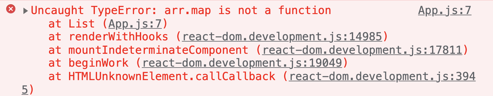
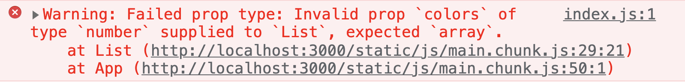

# React组件进阶

+ [ ] children属性
+ [ ] props校验
+ [ ] useEffect hook

## children 属性

**目标：**掌握props中children属性的用法

**内容**：

+ children 属性：表示该组件的子节点，只要组件有子节点，props就有该属性

+ children 属性与普通的 props 一样，值可以是任意值（文本、React元素、组件，甚至是函数）

**核心代码**：

```jsx
const Hello = props => {
  return (
    <div>
      该组件的子节点：{props.children}
    </div>
  )
}

<Hello>我是子节点</Hello>
```

练习：实现标题栏组件

App.js 中：

```jsx
const NavBar = props => {
  return (
    <div className="nav-bar">
      <span>&lt;</span>
      <div className="title">{props.children}</div>
    </div>
  )
}

export default function App() {
  return (
    <div>
      <NavBar>标题</NavBar>
      <br />
      <NavBar>商品</NavBar>
      <br />
      <NavBar>
        <span style={{ color: 'red' }}>花哨的标题</span>
      </NavBar>
    </div>
  )
}
```

App.css 中：

```css
.nav-bar {
  display: flex;
  position: relative;
  background-color: #9696dc;
  padding: 5px;
  text-align: center;
}

.title {
  position: absolute;
  width: 100%;
  height: 100%;
}
```

## props 校验

**目标：**能够使用prop-types校验组件的props

**内容：**

[props 校验文档](https://reactjs.org/docs/typechecking-with-proptypes.html)

对于组件来说，props 是外来的，无法保证组件使用者传入什么格式的数据

如果传入的数据格式不对，可能会导致组件内部报错，关键是：**组件的使用者不能很明确的知道错误的原因**

比如，以下的示例代码会报错，并且无法根据错误，准确的定位出现问题的原因：

```jsx
// 假设，这是 小明 创建的 List 组件
const List = props => {
  const arr = props.colors
  const lis = arr.map((item, index) => <li key={index}>{item.name}</li>)
	return (
		<ul>{lis}</ul>
	)
}

// 小红使用小明创建的 List 组件
<List colors={19} />
```

错误信息如下：



如何解决？ **props 校验**

**props校验**：允许在创建组件的时候，就约定props的格式、类型等

```jsx
// 约定 List 组件的 colors 属性是数组类型
// 如果不是数组就会报错，增加组件的健壮性
List.propTypes = {
  colors: PropTypes.array
}
```

此时，代码同样会报错，但是，我们可以拿到更加明确的错误提示：



**步骤**：

1. 安装属性校验的包：`npm i prop-types`
2. 导入 `prop-types` 包
3. 使用`组件名.propTypes = {}` 来给组件 List 的props添加校验规则
4. 为组件添加 `propTypes` 属性，并通过 `PropTypes` 对象来指定属性的类型

**核心代码**：

```jsx
import PropTypes from 'prop-types'

const List = props => {
  const arr = props.colors
  const lis = arr.map((item, index) => <li key={index}>{item.name}</li>)
  return <ul>{lis}</ul>
}

// 给组件添加 props 校验
List.propTypes = {
  colors: PropTypes.array
}
```

## useEffect Hook

### 副作用介绍

**目标：**能够说出什么是副作用

**内容：**

`side effect`：副作用

使用场景：当你想要在函数组件中，**处理副作用（side effect）时**，就要使用 **useEffect** Hook 了

作用：**处理函数组件中的副作用（side effect）**

问题：副作用（side effect）是什么? 
回答：在计算机科学中，如果一个函数或其他操作修改了其局部环境之外的状态变量值，那么它就被称为有副作用

类比，对于 999 感冒灵感冒药来说：

- （主）作用：用于感冒引起的头痛，发热，鼻塞，流涕，咽痛等
- 副作用：可见困倦、嗜睡、口渴、虚弱感

理解：副作用是相对于主作用来说的，一个功能（比如，函数）除了主作用，其他的作用就是副作用

对于 React 组件来说，**主作用就是根据数据（state/props）渲染 UI**，除此之外都是副作用（比如，手动修改 DOM）

常见的副作用（side effect）：数据（Ajax）请求、手动修改 DOM、localStorage、console.log 操作等

React 组件的极简公式：`f(state) => UI`

**总结**：

​	对于react组件来说，除了渲染UI之外的其他操作，都可以称之为副作用

```jsx
const Count = () => {
  const [count, setCount] = useState(0)

  const handleClick = () => {
    setCount(count + 1)
  }
  
  // ---- 演示 副作用 ----
  console.log('aaa')				// 影响浏览器控制台的输出
  axios.post('http://xxx')	// 影响后端接口数据
  localStorage.setItem()		// 影响浏览器本地存储
  // ---- 演示 副作用 ----
  
  return (
    <div>
      <h1>计数器：{count}</h1>
      <button onClick={handleClick}>+1</button>
    </div>
  )
}
```

### 基本使用

**目标：**能够在函数组件中操作DOM（处理副作用）

**内容：**

使用场景：当你想要在函数组件中，处理副作用（side effect）时就可以使用 useEffect Hook 了

作用：处理函数组件中的一些副作用（side effect）

注意：在实际开发中，副作用是不可避免的。因此，react 专门提供了 **useEffect** Hook **来处理函数组件中的副作用**

语法：

- 参数：回调函数（称为 **effect**），就是**在该函数中写副作用代码**
- 执行时机：该 effect 会在组件第一次渲染以及每次组件更新后执行

```jsx
import { useEffect } from 'react'

useEffect(function effect() {
  document.title = `当前已点击 ${count} 次`
})

useEffect(() => {
  document.title = `当前已点击 ${count} 次`
})
```

示例：

```jsx
import { useEffect } from 'react'

const Counter = () => {
  const [count, setCount] = useState(0)
  
  useEffect(() => {
    document.title = `当前已点击 ${count} 次`
  })
  
  return (
  	<div>
    	<h1>计数器：{count}</h1>
      <button onClick={() => setCount(count + 1)}>+1</button>
    </div>
  )
}
```

### 依赖项

**目标：**能够设置 useEffect 的依赖只在 count 变化时执行相应的 effect

**内容：**

- 问题：如果组件中有另外一个状态，另一个状态更新时，刚刚的 effect 回调也会执行 
- 默认情况：只要状态发生更新 useEffect 的 effect 回调就会执行
- 性能优化：**跳过不必要的执行，只在 count 变化时，才执行相应的 effect**
- 此时，需要传入第二个参数：可选，也可以传一个数组，数组中的元素就是依赖项（deps） 

```js
  useEffect(() => {
    // 该示例中表示：只有当 count 改变时，才会重新执行该 effect
    document.title = `当前已点击 ${count} 次`
  }, [count])
```

**核心代码：**

```jsx
import { useEffect } from 'react'

const Counter = () => {
  const [count, setCount] = useState(0)
  const [loading, setLoading] = useState(false)
  
  useEffect(() => {
    document.title = `当前已点击 ${count} 次`
  }, [count])
  
  return (
  	<div>
    	<h1>计数器：{count}</h1>
      <button onClick={() => setCount(count + 1)}>+1</button>
      <button onClick={() => setCount(!loading)}>切换 loading</button>
    </div>
  )
}
```

### 不要对依赖项撒谎

**目标：**能够理解不正确使用依赖项的后果

**内容：**

- useEffect 回调函数（effect）中用到的数据（比如，count）就是依赖数据，就应该出现在依赖项数组中
- 如果 useEffect 回调函数中用到了某个数据，但是，没有出现在依赖项数组中，就会导致一些 Bug 出现！
- 所以，不要对 useEffect 的依赖撒谎 

```jsx
const App = () => {
  const [count, setCount] = useState(0)
  
  // 错误演示：
  useEffect(() => {
    document.title = '点击了' + count + '次'
  }, [])
  
  return (
    <div>
      <h1>计数器：{count}</h1>
      <button onClick={() => setCount(count + 1)}>+1</button>
    </div>
  )
}
```

参考资料：

- [useEffect完全指南](https://overreacted.io/zh-hans/a-complete-guide-to-useeffect/)

### 依赖项是一个空数组

**目标**：能够只在组件第一次渲染时执行某个effect

**内容**：

- useEffect 的第二个参数，还可以是一个**空数组（[]）**，表示只在组件第一次渲染后执行 effect
- 使用场景：1 事件绑定  2 发送请求获取数据 等

```js
// 演示：给 window 绑定窗口大小改变的事件，该事件只需要绑定一次即可
useEffect(() => {
  const handleResize = () => {}
  window.addEventListener('resize', handleResize)
}, [])
```

注意：

- 跟 useState Hook 一样，一个组件中也可以调用 useEffect Hook 多次 
- 推荐：**一个 useEffect 只处理一个功能，有多个功能时，使用多次 useEffect**

### 清理工作

**目标：**能够在组件卸载的时候清除注册的事件

**内容：**

- 场景：我们手动给 window 绑定的事件，在组件卸载后就没用了，因此，需要在组件卸载时，手动清理事件
- 问题：如何在组件卸载时，清理手动绑定的事件呢？
- 回答：通过 effect 函数的返回值来实现
- effect 的**返回值**是可选的，可省略。也可以返回一个**清理函数**，用来执行事件解绑等清理操作
- 清理函数的执行时机：
  1. 如果依赖数项数组为空，清理函数会在组件卸载时执行
  2. 如果依赖项数组不为空，会在依赖项数据改变时执行，当然，组件卸载时也会执行

**核心代码：**

```jsx
useEffect(() => {
  const handleResize = () => {}
  window.addEventListener('resize', handleResize)
  
  // 这个返回的函数，会在该组件卸载时来执行
  // 因此，可以去执行一些清理操作，比如，解绑 window 的事件、清理定时器 等
  return () => window.removeEventListener('resize', handleResize)
}, [])
```

### 语法总结

**目标：**能够说出useEffect的 4 种使用使用方式

**内容**：

```js
// 1
// 触发时机：1 第一次渲染会执行 2 每次组件重新渲染都会再次执行
useEffect(() => {})

// 2（**使用频率最高**）
// 触发时机：只在组件第一次渲染时执行
useEffect(() => {}, [])

// 3（**使用频率最高**）
// 触发时机：1 第一次渲染会执行 2 当 count 变化时会再次执行
useEffect(() => {}, [count])

// 4.1
useEffect(() => {
  // 返回值函数的执行时机：组件卸载时
  return () => {
    // 执行清理工作
  }
}, [])
// 4.2
useEffect(() => {
  
  // 返回值函数的执行时机：1 组件卸载时 2 count 变化时
  return () => {}
}, [count])
```

### 练习

**目标**：能够实现B站评论列表案例的数据持久化

**步骤**：

1. 在组件挂载时，从本地存储中读取 list 数据
2. 将读取到的 list 数据，更新到状态中
3. “监听” list 数据的改变，将最新的 list 数据存到本地存储中

**核心代码**：

```jsx
// 组件初次渲染时，从本地存储中读取 list 并更新到状态中
useEffect(() => {
  const list = JSON.parse(localStorage.getItem('list') || '[]')
	setList(list)
}, [])

// “监听” list 状态的改变，只要 list 状态改变了，就将其保存到 本地存储 中
useEffect(() => {
  localStorage.setItem('list', JSON.stringify(list))
}, [list])
```

### useEffect应用-发送请求

**目的：**能够在函数组件中通过useEffect发送ajax请求

**内容：**

+ 在组件中，可以使用 useEffect Hook 来发送请求（side effect）获取数据
+ 注意：**effect 只能是一个同步函数，不能使用 async**
  + 因为如果 effect 是 async 的，此时返回值是 Promise 对象。这样的话，就无法保证清理函数被立即调用
+ 为了使用 async/await 语法，可以在 effect 内部创建一个新的 async 函数，并调用

**核心代码：**

```jsx
// 正确使用
useEffect(() => {
  const loadData = async () => {
    const res = await axios.get('http://xxx')
  }
  loadData()
}, [])

// ---

// 错误演示：不要给 effect 添加 async
useEffect(async () => {
  const res = await axios.get('http://xxx')
  return () => {}
}, [])
```

## 补充：RESTFul API

**目标**：能够知道什么是 RESTFul API

**内容**：

`RESTFul API` （或 REST API）是一套流行的接口设计风格，参考 [RESTFul API 设计指南](https://www.ruanyifeng.com/blog/2014/05/restful_api.html)

约定：**请求方式是动词，接口地址使用名词**

使用 `RESTFul API` 时，常用请求方式有以下几种：

- GET（查询）：从服务器获取资源
- POST（新建）：在服务器新建一个资源
- DELETE（删除）：从服务器删除资源
- PUT（更新）：在服务器更新资源（注意：需要提供接口所需的完整数据）
- PATCH（更新）：在服务器更新资源（只需要提供接口中要修改过的数据）

示例：

- GET /zoos：获取所有动物园
- POST /zoos：新建一个动物园
- GET /zoos/ID：获取某个动物园的信息
- DELETE /zoos/ID：删除某个动物园
- PUT /zoos/ID：更新某个动物园的信息（提供该动物园的全部信息）
- PATCH /zoos/ID：更新某个动物园的信息（提供该动物园的部分信息）

```js
// PUT 和 PATCH 请求的区别演示：

比如，动物园数据包含：{ name, address, animals }，假设要修改 name 属性，此时：
使用 patch 请求：只需要传入 { name } 即可
使用 put 请求：需要传入完成数据 { name, address, animals }
```

## 补充：json-server 提供接口数据

**目标**：能够使用 json-server 提供接口数据

**内容**：

- [json-server 文档](https://www.npmjs.com/package/json-server)
- 作用：根据 json 文件创建 RESTful 格式的 API 接口

**步骤**：

1. 准备文件data.json

```json
{
  "tabs": [
    {
      "id": 1,
      "name": "热度",
      "type": "hot"
    },
    {
      "id": 2,
      "name": "时间",
      "type": "time"
    }
  ],
  "list": [
    {
      "id": 1,
      "author": "143 15K",
      "comment": "瓜子 啤酒",
      "time": "2021-11-24T03:13:40.644Z",
      "attitude": 0
    }
  ]
}
```

2. 使用 json-server 启动接口

```shell
# 使用 npx 命令调用 json-server
# 指定用于提供数据的 json 文件
# --port 用于修改端口号
# --watch 表示监听 json 文件的变化，当变化时，可以不重启终端命令的前提下读取到 json 文件中的最新的内容
npx json-server ./data.json --port 8888 --watch

# 接口地址为：
http://localhost:8888/tabs
http://localhost:8888/list
```

3. 使用接口

```js
axios.get('http://localhost:8888/tabs')
```

## 综合案例-B站评论列表

使用 useEffect 配合接口数据改造 B站评论列表 案例

### 1. 获取tabs和list数据

**目标**：能够使用useEffect hook获取tabs数据

**步骤**：

1. 安装并导入 axios
2. 导入并调用 useEffect hook，传入空数组作为依赖
3. 在 effect 中创建函数 loadData 用来发送请求获取
4. 发送请求获取 tabs 和 list 数据
5. 更新 tabs 和 list 数据

**核心代码**：

```jsx
// 提供 tabs 状态
const [tabs, setTabs] = useState([])
// 评论列表状态
const [list, setList] = useState([])

useEffect(() => {
  const loadData = async () => {
    const tabsRes = await axios.get('http://localhost:8888/tabs')
    const listRes = await axios.get('http://localhost:8888/list')

    setTabs(tabsRes.data)
    setList(listRes.data)
  }
  loadData()
}, [])
```

### 2. 添加评论

**目标**：能够实现添加评论功能

**步骤**：

1. 在添加评论的事件处理程序中，发送 post 请求，不需要处理 id（json-server会自动生成id）
2. 将新添加的评论数据，更新到 list 状态中

**核心代码**：

```jsx
// 发表评论
const onAdd = async text => {
  const res = await axios.post('http://localhost:8888/list', {
    author: '143 帅哥美女',
    comment: text,
    time: new Date(),
    // 1: 点赞 0：无态度 -1:踩
    attitude: 0,
  })

  setList([res.data, ...list])
}
```

### 3. 删除评论

**目标**：能够实现删除评论功能

**步骤**：

1. 在删除评论的事件处理程序中，发送 delete 请求，并将要删除项的 id 添加到接口路径中
2. 删除本地的 list 中对应的评论数据，并更新状态

**核心代码**：

```jsx
// 删除评论项
const onDelete = async id => {
  await axios.delete(`http://localhost:8888/list/${id}`)

  const newList = list.filter(comment => comment.id !== id)
  setList(newList)
}
```

### 4. 点赞或踩

**目标**：能够实现点赞或踩功能

**步骤**：

1. 在点赞或踩的事件处理程序中，发送 patch 请求
2. 将要修改的评论id添加到接口路径中，将要修改的数据作为第二个参数
3. 更新本地的 list 中对应的评论数据，并更新状态

**核心代码**：

```jsx
const changeAttitude = async (id, attitude) => {
  await axios.patch(`http://localhost:8888/list/${id}`, {
    attitude,
  })

  const newList = list.map(item => {
    if (item.id === id) {
      return {
        ...item,
        attitude,
      }
    }
    return item
  })
  setList(newList)
}
```


