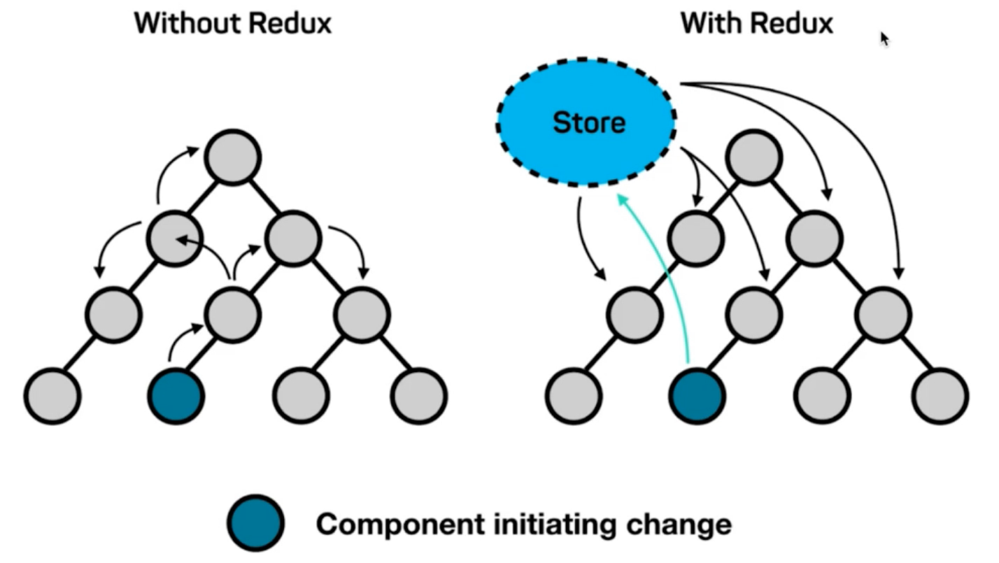
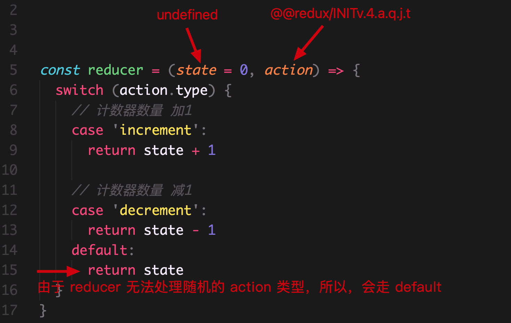
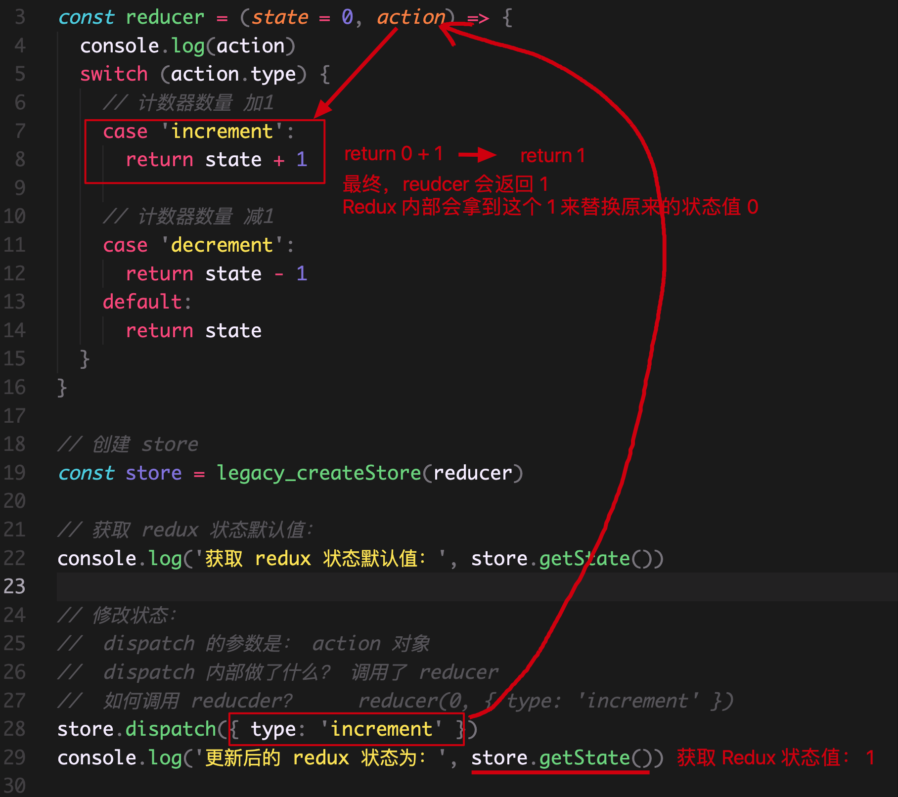

# Redux基础

+ [ ] redux基本介绍
+ [ ] redux核心概念
+ [ ] redux的执行过程
+ [ ] react-redux的使用

## 为什么要用 Redux

**目标：**能够说出为什么需要使用redux

**内容：**

[redux 中文文档](http://cn.redux.js.org/)

[redux 英文文档](https://redux.js.org/)

> Redux 是 React 中最常用的状态管理工具（状态容器）

React 只是 DOM 的一个抽象层（UI 库），并不是 Web 应用的完整解决方案。因此 React 在涉及到数据的处理以及组件之间的通信时会比较复杂

对于大型的复杂应用来说，这两方面恰恰是最关键的。因此，只用 React，写大型应用比较吃力

背景介绍：

- 2014 年 Facebook 提出了 Flux 架构的概念（前端状态管理的概念），引发了很多的实现
- 2015 年，Redux 出现，将 Flux 与*函数式编程*结合一起，很短时间内就成为了最热门的前端架构
- Flux 是最早的前端的状态管理工具，它提供了状态管理的思想，也提供对应的实现
- 除了 Flux、Redux 之外，还有：Mobx 等状态管理工具

问题：为什么要用 Redux?



- 主要的区别：**组件之间的通讯问题**
- 不使用 Redux (图左边) ：
  - 只能使用父子组件通讯、状态提升等 React 自带机制 
  - 处理远房亲戚(非父子)关系的组件通讯时乏力
  - 组件之间的数据流混乱，出现 Bug 时难定位
- 使用 Redux (图右边)：
  - **集中式存储和管理应用的状态**
  - 处理组件通讯问题时，**无视组件之间的层级关系** 
  - 简化大型复杂应用中组件之间的通讯问题
  - 数据流清晰，易于定位 Bug

## Redux 开发环境准备

**目标：**能够在react项目中准备redux开发环境

**内容：**

使用 React CLI 来创建项目，并安装 Redux 包即可：

1. 创建 React 项目：`npx create-react-app redux-basic`
2. 启动项目：`yarn start`
3. 安装 Redux 包：`npm i redux ` 或 `yarn add redux`

## Redux 核心概念

### 概述

**目标：**能够理解redux三个核心概念的职责

**内容：**

为了让**代码各部分职责清晰、明确**，Redux 代码被分为三个核心概念：action/reducer/store

- action -> reducer -> store
- **action**（动作）：描述要做的事情
- **reducer**（函数）：更新状态
- **store**（仓库）：整合 action 和 reducer

类比生活中的例子来理解三个核心概念：

- action：相当于公司中要做的事情，比如软件开发、测试，打扫卫生等
- reducer：相当于公司的员工，负责干活的
- store：相当于公司的老板
- 流程：老板(store)分配公司中要做的事情(action)给员工(reducer)，员工干完活把结果交给老板

### 核心概念-action

**目标**：能够定义一个最基本的action

**内容：**

action：动作，描述要做的事情，项目中的每一个功能都是一个 action。比如，
- 计数器案例：计数器加1、减1
- 购物车案例：获取购物车数据、切换商品选中状态
- Todos 案例：添加任务、删除任务
- 项目：登录，退出等

特点：
- 只描述做什么
- 使用 JS 对象来表示，必须带有 `type` 属性，用于区分动作的类型
- 根据功能的不同，可以携带额外的数据（比如，`payload` 有效载荷，也就是附带的额外的数据），配合该数据来完成相应功能

```js
// action

// 计数器案例
{ type： 'increment' } // +1
{ type： 'decrement' } // -1

{ type： 'increment', payload: 10 } // +10
{ type： 'decrement', payload: 10 } // -10

// todos
// 添加任务
{ type: 'addTodo', payload: '吃饭' }
// 删除任务
{ type: 'delTodo', payload: 1 }

// 登录功能的 action ，比如，登录时需要 username 和 password
{ type: 'login', payload: { username: 'admin', password: '123456' } }
```

### action creator

**目标**：能够使用函数去创建一个action

**内容**：

- `Action Creator` 指的是：使用函数创建 action 对象
- 目的：简化多次使用 action 时，重复创建 action 对象

**核心代码**：

```js
// 不使用 Action Creator
// 创建多个 action 时，需要重复手动创建 action 对象，很繁琐
{ type: 'decrement', payload: 2 }
{ type: 'decrement', payload: 8 }

// ---

// 使用 Action Creator
// 1 先创建 Action Creator 函数
const decrement = payload => {
  return { type: 'decrement', payload }
}
// 简化：
const decrement = payload => ({ type: 'decrement', payload })

// 2 创建多个 action，只需要调用 Action Creator 函数即可
decrement(2) // => { type: 'decrement', payload: 2 }
decrement(8) // => { type: 'decrement', payload: 8 }
```

### 核心概念-reducer

**目标：**能够掌握reducer的基本写法

**内容：**

- reducer 单词的意思：减速器
- 这个名字是参考了 JS 数组中的 `reduce` 这个方法  
  - 数组中的 `reduce` 方法，可以来实现累计（比如，累加或者累减）
- reducer：函数，**用来处理 action 并更新状态，是 Redux 状态更新的地方**
- 特点：
  - 函数签名为：`(prevState, action) => newState`
  - 接收上一次的状态和 action 作为参数，根据 action 的类型，执行不同操作，最终返回新的状态
  - 注意：**该函数一定要有返回值**，即使状态没有改变也要返回上一次的状态

**核心代码**：

```jsx
// 伪代码：
// prevState 上一次的状态
// action 当前要执行的动作
const reducer = (prevState, action) => {
  return newState
}

// 示例：
// state 上一次的状态
// action 当前要执行的动作
const reducer = (state, action) => {
  switch (action.type) {
    // 计数器增加
    case 'increment':
      // 返回新状态
      return state + 1
    // 注意：一定要有 default，如果将来 reducer 无法处理某个 action，就直接将上一次的状态返回即可
    default:
      return state
  }
}

// 模拟 reducer 的调用

// 第一次调用 reducer
// reducer(0, { type: 'increment' }) // 本次执行完成后，状态变为：1

// 基于上一次的状态继续调用 reducer
// reducer(1, { type: 'decrement' }) // 本次因为无法处理该 action，所以，直接返回上一次的状态：1
```

### reducer 与纯函数

**目标：**了解纯函数的特点

**内容：**

- 约定：reducer 是一个**纯函数**，并且不能包含 side effect 副作用(比如，不能修改函数参数、不能修改函数外部数据、不能进行异步操作等)

- 纯函数是*函数式编程*中的概念，对于纯函数来说，**相同的输入总是得到相同的输出**
- 函数式编程，是一种编程范式。主要思想是：把运算过程尽量写成一系列嵌套的函数调用，参考资料：[函数式编程初探](https://www.ruanyifeng.com/blog/2012/04/functional_programming.html)
- 对于 reducer 来说，为了保证 reducer 是一个纯函数：
  1. 不要直接修改参数 state 的值（也就是：不要直接修改当前状态，而是根据当前状态值创建新的状态值）
  2. 不要使用 Math.random() / new Date() / Date.now() 等不纯的操作
  3. 不要让 reducer 执行副作用（side effect），比如，ajax 请求、DOM操作 等

纯函数的演示：

- 对于纯函数来说，不要执行**不纯**的操作，比如：不能使用 Date.now()、Math.random()、异步请求等操作，因为每次会得到不一样的结果

```jsx
// 纯函数：
const add = () => {
  return 123
}
add() // 123
add() // 123

const add = (num1, num2) => {
  return num1 + num2
}
add(1, 2) // 3
add(1, 2) // 3

const add = (obj) => {
  return obj
}
add({ name: 'jack' }) // { name: 'jack' }
add({ name: 'jack' }) // { name: 'jack' }

// ---

// 符合纯函数的概念
// 带有副作用，因为直接修改了变量的值，对外部的数据产生了影响
const add = (obj) => {
	obj.num = 123
  return obj
}

add({ a: '1' }) // { a: '1', num: 123 }
add({ a: '1' }) // { a: '1', num: 123 }

// ---

// 不是纯函数：
// 每次得到的结果不同
const add = () => {
  return Math.random()
}

add() // 0.12311293827497123
add() // 0.82239841238741814
```

副作用的演示：

- 如果一个函数或其他操作修改了其局部环境之外的状态变量值，那么它就被称为有副作用

```js
// 无副作用
const add = (num1, num2) => {
  return num1 + num2
}
add(1, 3)

// ---

// 有副作用：
let c = 0
const add = (num1, num2) => {
  // 函数外部的环境产生了影响，所以是有副作用的
  c = 1
  return num1 + num2
}
add(1, 3)
console.log(c)

// 有副作用：
const add = (obj) => {
  // 因为直接修改了参数的值，对外部的数据产生了影响
	obj.num = 123
  return obj
}
const o = {}
add(o)
console.log(o) // { num: 123 }

// 有副作用：
const add = (num1, num2) => {
  // 因为该操作，会让浏览器控制额外的打印一些内容
  console.log('add')
  return num1 + num2
}
add(1, 3)
```

### Redux核心概念-store

**目标：**通过store关联action和reducer

**内容：**

- store：仓库，Redux 的核心，整合 action 和 reducer

- 特点：
  - **一个应用只有一个 store**
  - 维护应用的状态，获取状态：`store.getState()`
  - 发起状态更新时，需要分发 action：`store.dispatch(action)`
  - 创建 store 时**接收 reducer 作为参数**：`const store = createStore(reducer)`
- 其他 API，
  - 订阅(监听)状态变化：`const unSubscribe = store.subscribe(() => {}) `
  - 取消订阅状态变化： `unSubscribe()`

**核心代码**：

```js
import { createStore } from 'redux'

// 创建 store
// 参数为：reducer 函数
const store = createStore(reducer)

// 更新状态
// dispatch 派遣，派出。表示：分发一个 action，也就是发起状态更新
store.dispatch(action)
store.dispatch( increment(2) )

// 获取状态
const state = store.getState()

// ---
// 其他 API

// 监听状态变化
const unSubscribe = store.subscribe(() => {
  // 状态改变时，执行相应操作
  // 比如，记录 redux 状态
  console.log(store.getState())
})

// 取消监听状态变化
unSubscribe()
```

---

## Redux 代码执行流程

### 获取状态默认值的执行过程

**目标**：能够知道 redux 获取状态默认值的执行过程

**内容**：

- 我们发现：只要创建 store，那么，Redux 就会调用一次 reducer

- 这一次调用 reducer 的目的：**获取状态的默认值**

- Redux 是如何调用 reducer？
  - Redux 内部第一次调用 reducer： `reducer(undefined, {type: "@@redux/INITv.a.4.t.t.p"})`

- 因为传入的状态值是 undefined ，并且是一个随机的 action type，所以：
  1. 状态值因为 undefined，所以，我们设置的默认值就会生效，比如，此处的：0

  2. 因为是一个随机的 action type，所以，reducer 中 switch 一定无法处理该 action，那就一定会走 default。也就是直接返回了状态的默认值：0
  3. Redux 内部拿到状态值（比如，此处的 0）以后，就用这个状态值，来作为了 store 中状态的默认值

- 因此，将来当我们调用 `store.getState()` 方法来获取 Redux 状态值的时候，拿到的就是 0 了

**核心代码**：

<figure class="third">
  
  
</figure>

```jsx
// 导入 createStore
import { createStore } from 'redux'
// 创建 store
const store = createStore(reducer)

function reducer(state = 10, action) {
  console.log('reducer:', state, action)
  switch (action.type) {
    case 'increment':
      return state + 1
    default:
      return state
  }
}

console.log('store 状态值为：', store.getState())
```

### 代码执行流程

**目标**：能够说出 redux 代码的执行流程

**内容**：

1. 创建 store 时，Redux 就会先调用一次 reducer，来获取到默认状态
2. 分发动作 `store.dispatch(action) ` 更新状态
3. Redux store 调用 reducer 传入：上一次的状态（当前示例中就是：`10`）和 action（`{ type: 'increment' }`），计算出新的状态并返回
4. reducer 执行完毕后，将最新的状态交给 store，store 用最新的状态替换旧状态，状态更新完毕

```js
import { createStore } from 'redux'
const store = createStore(reducer)

// reducer(10, { type: 'increment' })
function reducer(state = 10, action) {
  console.log('reducer:', state, action)
  switch (action.type) {
    case 'increment':
      return state + 1
    default:
      return state
  }
}

console.log('状态值为：', store.getState()) // 10

// 发起更新状态：
// 参数： action 对象
store.dispatch({ type: 'increment' })
// 相当于： reducer(10, { type: 'increment' })

console.log('更新后：', store.getState()) // 11
```

---

## React-Redux 绑定库

### 介绍

**目标：**能够说出为什么需要使用react-redux

**内容：**

- 问题：为什么要使用 React-Redux 绑定库？
- 回答：React（ `f(state) => UI` ） 和 Redux（管理状态） 是两个独立的库，两者之间职责独立。因此，为了实现在 React 中使用 Redux 进行状态管理 ，就需要一种机制，将这两个独立的库关联在一起。这时候就用到 React-Redux 这个绑定库了。
- 作用：**为 React 接入 Redux，实现在 React 中使用 Redux 进行状态管理**。 
- react-redux 库是 Redux 官方提供的 React 绑定库。


### 基本使用

**目标**：使用react-redux库在react中使用redux管理状态

**内容**：

[react-redux 文档](https://react-redux.js.org/introduction/getting-started)

react-redux 的使用分为两大步：1 全局配置（只需要配置一次） 2 组件接入（获取状态或修改状态）

先看全局配置：

**步骤**：

1. 安装 react-redux：`yarn add react-redux`
2. 从 react-redux 中导入 Provider 组件
3. 导入创建好的 redux 仓库
4. 使用 Provider 包裹整个应用
5. 将导入的 store 设置为 Provider 的 store 属性值

**核心代码**：

src/index.js 中：

```jsx
// 导入 Provider 组件
import { Provider } from 'react-redux'
// 导入创建好的 store
import store from './store'

root.render(
  <Provider store={store}>
    <App />
  </Provider>
)
```

### 获取状态useSelector

**目标**：能够使用 useSelector hook 获取redux中共享的状态

**内容**：

- `useSelector`：获取 Redux 提供的状态数据
- 参数：selector 函数，用于从 Redux 状态中筛选出需要的状态数据并返回
- 返回值：筛选出的状态
- 注意：任何一个 React 组件中，想要获取 redux 中的状态，都可以直接调用 `useSelector` hook 即可

```js
import { useSelector } from 'react-redux'

// 计数器案例中，Redux 中的状态是数值，所以，可以直接返回 state 本身
const count = useSelector(state => state)

// 比如，Redux 中的状态是个对象，就可以：
const list = useSelector(state => state.list)
```

**核心代码**：

App.js 中：

```jsx
import { useSelector } from 'react-redux'

const App = () => {
  const count = useSelector(state => state)
  
  return (
  	<div>
    	<h1>计数器：{count}</h1>
      <button>数值增加</button>
			<button>数值减少</button>
    </div>
  )
}
```

### 分发动作useDispatch

**目标**：能够使用 useDispatch hook 修改redux中共享的状态

**内容**：

- `useDispatch`：拿到 dispatch 函数，分发 action，修改 redux 中的状态数据

```js
import { useDispatch } from 'react-redux'

// 调用 useDispatch hook，拿到 dispatch 函数
const dispatch = useDispatch()

// 调用 dispatch 传入 action，来分发动作
dispatch( action )
```

**核心代码**

App.js 中：

```jsx
import { useDispatch } from 'react-redux'

const App = () => {
  const dispatch = useDispatch()
  
  return (
  	<div>
    	<h1>计数器：{count}</h1>
      {/* 调用 dispatch 分发 action */}
      <button onClick={() => dispatch(increment(2))}>数值增加</button>
			<button onClick={() => dispatch(decrement(5))}>数值减少</button>
    </div>
  )
}
```

## 理解 Redux 数据流

**目标**：能够说出redux数据流动过程

**内容**：


**内容**：

从 React 组件开始  ==> Redux ==> React组件结束

1. 在 React 组件中，点击按钮，触发了按钮的点击事件
2. 在点击事件中，我们通过 `dispatch({ type: 'increment' })` 分发了一个 action
3. 当我们调用 dispatch 函数时，Redux 就会调用 reducer，调用方式：`reducer(redux自己维护的状态, dispatch时的action)`
4. reducer 根据上一次的状态（state） 以及 当前要执行的动作（action），来计算出一个新的状态，并且返回这个新状态
5. Redux 内部拿到这个新的状态，用这个状态来作为最新 Redux 状态值
6. 由于 Redux 状态发生改变，所以，会通知 React 组件，来重新渲染 React 组件
7. React 组件重新渲染，就会重新执行组件中的代码，这样，就可以拿到最新的 Redux 状态，从而来更新组件内容

**总结**：

- 任何一个组件都可以直接接入 Redux，也就是可以直接：1 修改 Redux 状态 2 接收 Redux 状态
- 并且，只要 Redux 中的状态改变了，所有接收该状态的组件都会收到通知，也就是可以获取到最新的 Redux 状态
- 这样的话，两个组件不管隔得多远，都可以**直接通讯**了

## Redux应用

### 代码结构

**目标**：能够组织redux的代码结构

**内容**：

在使用 Redux 进行项目开发时，不会将 action/reducer/store 都放在同一个文件中，而是会进行拆分

可以按照以下结构，来组织 Redux 的代码：

```html
/store        --- 在 src 目录中创建，用于存放 Redux 相关的代码
  /actions    --- 存放所有的 action
  /reducers   --- 存放所有的 reducer
  index.js    --- redux 的入口文件，用来创建 store
```
### ActionType的使用

**目标**：能够知道为什么要抽离 action type

**内容**：

- Action Type 指的是：action 对象中 type 属性的值
- Redux 项目中会多次使用 action type，比如，action 对象、reducer 函数、dispatch(action) 等
- 目标：**集中处理 action type，保持项目中 action type 的一致性**
- action type 的值采用：`'domain/action'(功能/动作)形式`，进行分类处理，比如，
  - 计数器：`'counter/increment'` 表示 Counter 功能中的 increment 动作
  - 登录：`'login/getCode'` 表示登录获取验证码的动作
  - 个人资料：`'profile/get'` 表示获取个人资料

**步骤**：

1. 在 store 目录中创建 `actionTypes` 目录或者 `constants` 目录，集中处理
2. 创建**常量**来存储 action type，并导出
4. 将项目中用到 action type 的地方替换为这些常量，从而保持项目中 action type 的一致性

```js
// actionTypes 或 constants 目录：

const increment = 'counter/increment'
const decrement = 'counter/decrement'

export { increment, decrement }

// --

// 使用：

// actions/index.js
import * as types from '../acitonTypes'
const increment = payload => ({ type: types.increment, payload })
const decrement = payload => ({ type: types.decrement, payload })

// reducers/index.js
import * as types from '../acitonTypes'
const reducer = (state, action) => {
  switch (action.type) {
    case types.increment:
      return state + 1
    case types.decrement:
      return state - action.payload
    default:
      return state
  }
}
```

- *注：额外添加 Action Type 会让项目结构变复杂，此操作可省略。但，`domain/action` 命名方式强烈推荐！*

### Reducer的分离与合并

**目标**：能够合并redux的多个reducer为一个根reducer

**内容**：

- 随着项目功能变得越来越复杂，需要 Redux 管理的状态也会越来越多
- 此时，有两种方式来处理状态的更新：
  1. 使用一个 reducer：处理项目中所有状态的更新
  2. 使用多个 reducer：按照项目功能划分，每个功能使用一个 reducer 来处理该功能的状态更新
- 推荐：**使用多个 reducer（第二种方案）**，每个 reducer 处理的状态更单一，职责更明确
- 此时，项目中会有多个 reducer，但是 **store 只能接收一个 reducer**，因此，需要将多个 reducer 合并为根 reducer，才能传递给 store
- 合并方式：使用 Redux 中的 `combineReducers` 函数
- 注意：**合并后，Redux 的状态会变为一个对象，对象的结构与 combineReducers 函数的参数结构相同**
  - 比如，此时 Redux 状态为：`{ a： aReducer 处理的状态, b： bReducer 处理的状态 }`

```js
import { combineReducers } from 'redux'

// 计数器案例，状态默认值为：0
const aReducer = (state = 0, action) => { return state }
// Todos 案例，状态默认值为：[]
const bReducer = (state = [], action) => { return state }

// 合并多个 reducer 为一个 根reducer
const rootReducer = combineReducers({
  a1: aReducer,
  b: bReducer
})

// 创建 store 时，传入 根reducer
const store = createStore(rootReducer)

// 此时，合并后的 redux 状态： { a1: 0, b: [] }
```

- 注意：虽然在使用 `combineReducers` 以后，整个 Redux 应用的状态变为了`对象`，但是，对于每个 reducer 来说，每个 reducer 只负责整个状态中的某一个值
  - 也就是：**每个reducer只负责自己要处理的状态**
  - 举例：
    - 登录功能：`loginReducer` 处理的状态只应该是跟登录相关的状态
    - 个人资料：`profileReducer` 处理的状态只应该是跟个人资料相关的状态
- 合并 reducer 后，redux 处理方式：只要合并了 reducer，不管分发什么 action，所有的 reducer 都会执行一次。各个 reducer 在执行的时候，能处理这个 action 就处理，处理不了就直接返回上一次的状态。所以，我们分发的某一个 action 就只能被某一个 reducer 来处理，也就是最终只会修改这个 reducer 要处理的状态，最终的表现就是：分发了 action，只修改了 redux 中这个 action 对应的状态！

问题：当项目中有多个 reducer，Redux 是如何执行的？

回答：不管有多少个 reducer，只要 dispatch(action)，那么，所有的 reducer 都会被调用一次。如果 reducer 能处理 action 就返回新的状态值；如果处理不了，就返回上一次的状态值

### 哪些状态需要Redux管理

**目标**：能够知道什么状态可以放在redux中管理

**内容**：

不同状态的处理方式：

1. 将所有的状态全部放到 redux 中，由 redux 管理
2. 只将某些状态数据放在 redux 中，其他数据可以放在组件中，比如：
   - 如果一个状态，只在某个组件中使用（比如，表单项的值），推荐：放在组件中
   - 需要放到 redux 中的状态：
     1. 在多个组件中都要使用的数据【涉及组件通讯】
     2. 通过 ajax 请求获取到的接口数据【涉及到请求相关逻辑代码放在哪的问题】

## 综合案例-购物车案例


### 1. 项目初始化

**目标**：能够使用 React 脚手架创建项目并根据模板搭建页面结构

**分析说明**：

- 注意：React 脚手架默认支持 `sass`，但是需要自己手动安装 `sass` 依赖包（用来解析 sass 语法）
- 安装命令：`npm i -D sass`
- sass 是一个预编译CSS，支持两种文件后缀：1 `xxx.scss` 2 `xxx.sass`

```scss
// .scss 样式，跟 CSS 写法相同【推荐】

.header {
  color: red;
  font-size: 30px;
}
```

```scss
// .sass 样式，是一种简化语法，省略了 {} 以及分号

.header
	color: red
	font-size: 30px
```

**步骤**：

1. 清理项目目录
2. 根据模板搭建基本页面结构
3. 安装解析 sass 的包：`npm i -D sass`，重启项目

4. 安装 bootstrap：`npm i bootstrap@4.5.0`，并导入 bootstrap 样式文件

**核心代码**：

index.js 中：

```jsx
// 导入 bootstrap 样式文件：
import 'bootstrap/dist/css/bootstrap.css'
```

### 2. 配置Redux基本结构

**目标**：能够在购物车案例中配置Redux

**步骤**：

1. 安装 redux：`yarn add redux`
2. 在 src 目录中创建 store 文件夹
3. 在 store 目录中创建 actions、reducers 目录以及 index.js 文件
4. 在 reducers 目录中新建 cart.js 和 index.js 文件
5. 在 cart.js 中创建一个基本的 reducer 并导出
6. 在 reducers/index.js 中创建根 reducer 并导出
7. 在 store/index.js 中，导入根 reducer 并创建 store 然后导出

**核心代码**：

store/reducers/cart.js 中：

```js
// 默认值：
const initialState = [
  {
    "id": 1,
    "goods_name": "班俏BANQIAO超火ins潮卫衣女士2020秋季新款韩版宽松慵懒风薄款外套带帽上衣",
    "goods_img": "https://www.escook.cn/vuebase/pics/1.png",
    "goods_price": 108,
    "goods_count": 1,
    "goods_state": true
  },
  {
    "id": 2,
    "goods_name": "嘉叶希连帽卫衣女春秋薄款2020新款宽松bf韩版字母印花中长款外套ins潮",
    "goods_img": "https://www.escook.cn/vuebase/pics/2.png",
    "goods_price": 129,
    "goods_count": 2,
    "goods_state": true
  },
  {
    "id": 3,
    "goods_name": "思蜜怡2020休闲运动套装女春秋季新款时尚大码宽松长袖卫衣两件套",
    "goods_img": "https://www.escook.cn/vuebase/pics/3.png",
    "goods_price": 198,
    "goods_count": 1,
    "goods_state": false
  },
]

export const cart = (state = initialState, action) => {
  return state
}
```

store/reducers/index.js 中：

```js
import { combineReducers } from 'redux'

import { cart } from './cart'

const rootReducer = combineReducers({
  cart
})

export default rootReducer
```

store/index.js 中：

```js
import { createStore } from 'redux'
import rootReducer from './reducers'

const store = createStore(rootReducer)

export default store
```

### 3. 配置React-Redux

**目标**：能够在 购物车 案例中配置 react-redux

**步骤**：

1. 安装 react-redux：`npm i react-redux`
2. 在 src/index.js 中，导入 Provider 组件
3. 在 src/index.js 中，导入创建好的 store
4. 使用 Provider 包裹 App 组件，并设置其 store 属性

**核心代码**：

src/index.js 中：

```jsx
import { Provider } from 'react-redux'
import store from './store'
import App from './App'

root.render(
  <Provider store={store}>
    <App />
  </Provider>
)
```

### 4. 封装CartHeader组件

**目标**：能够封装购物车的CartHeader组件

**步骤**：

1. 新建 components/CartHeader/index.js 文件
2. 在该文件中，通过函数组件创建 CartHeader 组件
3. 通过 children 属性，接收传递过来的标题
4. 在 App 组件中导入 CartHeader 组件并渲染

**核心代码**：

src/components/CartHeader/index.js 中：

```jsx
import './index.scss'

// 按需导出
export const CartHeader = ({ children }) => {
  return <div className="cart-header">{children}</div>
}
```

src/components/CartHeader/index.scss 中：

```scss
.cart-header {
  z-index: 999;
  height: 45px;
  line-height: 45px;
  text-align: center;
  background-color: #1d7bff;
  color: #fff;
  position: fixed;
  top: 0;
  left: 0;
  width: 100%;
}
```

App.js 中：

```jsx
// 按需导入组件
import { CartHeader } from './components/CartHeader'

const App = () => {
  return (
    <div>
      <CartHeader>购物车</CartHeader>
    </div>
  )
}
```

### 5. 封装CartFooter组件

**目标：**能够封装购物车的CartFooter组件


**步骤**：

1. 创建 CartFooter 组件
2. 创建 CartFooter 组件的样式文件
3. 在 App 组件中渲染

**核心代码：**

src/components/CartFooter/index.js 中：

```jsx
import './index.scss'
const CartFooter = () => {
  return (
    <div className="cart-footer">
      <div className="custom-control custom-checkbox">
        <input
          type="checkbox"
          className="custom-control-input"
          id="footerCheck"
        />
        <label className="custom-control-label" htmlFor="footerCheck">
          全选
        </label>
      </div>
      <div>
        <span>合计:</span>
        <span className="price">¥ 100</span>
      </div>
      <button type="button" className="footer-btn btn btn-primary">
        结算 (0)
      </button>
    </div>
  )
}

export default CartFooter
```

src/components/CartFooter/index.scss 中：

```scss
.cart-footer {
  z-index: 999;
  position: fixed;
  bottom: 0;
  width: 100%;
  height: 50px;
  border-top: 1px solid #ccc;
  display: flex;
  justify-content: space-between;
  align-items: center;
  padding: 0 10px;
  background: #fff;

  .price {
    color: red;
    font-weight: bold;
    font-size: 15px;
  }
  .footer-btn {
    min-width: 80px;
    height: 30px;
    line-height: 30px;
    border-radius: 25px;
    padding: 0;
  }
}
```

App.js 中：

```jsx
import { CartFooter } from './components/CartFooter'

const App = () => {
  return (
    <div>
      <CartFooter />
    </div>
  )
}
```

### 6. 封装GoodsItem组件

**目标：**能够封装GoodsItems组件

**步骤**：

1. 创建 GoodsItem 组件
2. 提供 GoodsItem 组件的样式文件
3. 在 App 组件中渲染该组件
4. 为 App 组件添加样式，进行样式调整

**核心代码**：

src/components/GoodsItem/index.js 中：

```jsx
import './index.scss'
const GoodsItem = () => {
  return (
    <div className="cart-goods-item">
      <div className="left">
        <div className="custom-control custom-checkbox">
          <input type="checkbox" className="custom-control-input" id="input" />
          <label className="custom-control-label" htmlFor="input">
            
          </label>
        </div>
      </div>
      <div className="right">
        <div className="top">商品名称</div>
        <div className="bottom">
          <span className="price">¥ 商品价格</span>
          <span>counter组件</span>
        </div>
      </div>
    </div>
  )
}

export default GoodsItem
```

src/components/GoodsItem/index.scss 中：

```scss
.cart-goods-item {
  display: flex;
  padding: 10px;
  border-bottom: 1px solid #ccc;
  .left {
    img {
      width: 120px;
      height: 120px;
      margin-right: 8px;
      border-radius: 10px;
    }
    .custom-control-label::before,
    .custom-control-label::after {
      top: 50px;
    }
  }
  .right {
    flex: 1;
    display: flex;
    flex-direction: column;
    justify-content: space-between;
    .bottom {
      display: flex;
      justify-content: space-between;
      padding: 5px 0;
      .price {
        color: red;
        font-weight: bold;
      }
    }
  }
}

```

App.js 中：

```jsx
import { GoodsItem } from './components/GoodsItem'

export default function App() {
  return (
    <div className="app">
      <GoodsItem />
    </div>
  )
}
```

App.scss 中：

```scss
.app {
  padding-top: 45px;
  padding-bottom: 50px;
}
```

### 7. 商品列表渲染

**目标**：能够完成商品列表的数据渲染

**步骤：**

1. 在 App 中通过 useSelector 获取到商品列表状态数据
2. 使用列表渲染，渲染商品列表
3. 将每个商品的数据通过组件的 props 传递给 GoodsItem 组件
4. 在 GoodsItem 组件中，拿到商品属性，进行渲染

**核心代码**：

App.js 中：

```jsx
const App = () => {
  const goodsList = useSelector(state => state.cart)

  return (
    <div className="app">
      {goodsList.map(item => (
        <GoodsItem key={item.id} {...item} />
      ))}
    </div>
  )
}

export default App
```

GoodsItem/index.js 中：

```jsx
import './index.scss'
export const GoodsItem = ({
  id,
  goods_name,
  goods_img,
  goods_price,
  goods_count,
  goods_state,
}) => {
  return (
    <div className="cart-goods-item">
      <div className="left">
        <div className="custom-control custom-checkbox">
          <input
            type="checkbox"
            className="custom-control-input"
            id={`input-${id}`}
          />
          <label className="custom-control-label" htmlFor={`input-${id}`}>
            
          </label>
        </div>
      </div>
      <div className="right">
        <div className="top">{goods_name}</div>
        <div className="bottom">
          <span className="price">¥ {goods_price}</span>
          <span>counter组件</span>
        </div>
      </div>
    </div>
  )
}
```

### 8. 商品选中功能

**目标**：能够完成商品的选中切换功能

**分析说明**：对于 checkbox 表单项来说，在使用受控组件获取值的时候，需要指定 `checked` 属性

**步骤：**

1. 在 GoodsItem 组件中通过传递过来的选中状态值作为复选框的 checked 值
2. 将 id 和 修改后的选中状态值回传给父组件
3. 父组件中准备一个用于修改修改选中状态的回调函数
4. 回调函数中，根据接收到的数据分发 action 来通知 redux 更新状态
5. 在 redcuers/cart 中，根据 action 的类型，来更新 redux 状态

**核心代码**：

GoodsItem/index.js 中：

```jsx
<input
  type="checkbox"
  className="custom-control-input"
  checked={goods_state}
  onChange={e => changeState(id, e.target.checked)}
/>
```

App.js 中：

```jsx
const changeGoodsState = (id, goods_state) => {
  dispatch({
    type: 'cart/changeGoodsState',
    payload: {
      id,
      goods_state,
    },
  })
}

// ...
<GoodsItem
  changeGoodsState={changeGoodsState}
/>
```

reducers/cart.js 中：

```js
const cart = (state = initialState, action) => {
  if (action.type === 'cart/changeGoodsState') {
    return state.map(item => {
      if (item.id === action.payload.id) {
        return {
          ...item,
          goods_state: action.payload.goods_state,
        }
      }
      return item
    })
  }
  return state
}
```

### 9. 商品全选功能

**目标**：能够完成商品全选切换功能

**分析说明**：

全选按钮是否选中，分为 3 种情况：

1. 进入页面时，判断所有商品是否都选中，如果都选中了，让全选按钮也选中；否则，不选中
2. 切换全选按钮的选中状态，商品的选中状态会随之切换
3. 切换商品的选中状态，全选按钮的选中状态会随之切换（已实现）

接下来，按照上面的 3 种情况，来实现该功能。

情况1：进入页面控制全选按钮的选中状态

**步骤**：

1. 在 CartFooter 组件中根据购物车数据，得到全选按钮的选中状态 isCheckAll
4. 将 isCheckAll 作为全选按钮的 checked 属性值

**核心代码：**

CartFooter.js 中：

```jsx
export const CartFooter = () => {
  const goodsList = useSelector(state => state.cart)
  const isCheckAll = goodsList.every(item => item.goods_state)
  
  return (
    <div className="my-footer">
      <div className="custom-control custom-checkbox">
        <input
          type="checkbox"
          className="custom-control-input"
          id="footerCheck"
          checked={isCheckAll}
        />
        <label className="custom-control-label" htmlFor="footerCheck">
          全选
        </label>
      </div>
      <div>
        <span>合计:</span>
        <span className="price">¥ 100</span>
      </div>
      <button type="button" className="footer-btn btn btn-primary">
        结算 (0)
      </button>
    </div>
  )
}
```

情况2：切换全选按钮的选中状态，控制商品的选中状态

**步骤**：

1. 在 CartFooter 组件中，给全选按钮添加 change 事件
2. 在 change 事件中，分发 action 准备更新 redux 状态
2. 在 reducers/cat 中，根据 action 类型来更新 redux 状态

**核心代码**：

CartFooter.js 中：

```jsx
const CartFooter = () => {
  const dispatch = useDispatch()

  const onChangeAll = e => {
    dispatch({
      type: 'cart/changeAll',
      payload: e.target.checked,
    })
  }
	return (
  	<input
      type="checkbox"
      className="custom-control-input"
      id="footerCheck"
      checked={isCheckAll}
      onChange={onChangeAll}
    />
  )
}
```

reducers/cart.js 中：

```jsx
const cart = (state = initialState, action) => {
  if (action.type === 'cart/changeAll') {
    return state.map(item => {
      return {
        ...item,
        goods_state: action.payload,
      }
    })
  }

  return state
}
```

### 10. 展示结算数量与总价

**目标**：能够展示结算数量和总价格

**内容**：

```js
// 计算数组中所有元素的和
const arr = [10, 30, 50]

// 只要是 累积 操作，都可以通过数组的 reduce 方法来实现
// 参数：
// 	第一个参数：回调函数，遍历数组时，数组中的每一项都会调用该回调函数
//	第二个参数：默认值，比如，此处要计算所有数字的和，默认值设置为 0 即可
arr.reduce((prev, item, index) => {
  // prev 表示：上一次的计算结果
  //	如果是第一次执行，那么，prev 就是默认值，也就是：0
  //	如果是第二次执行，那么，prev 就是上一次调用回调函数的返回值
  // item 表示：数组中的每一项
  
  return prev + item
}, 0)

// reduce 的执行过程：
// 第一次执行：
//	prev => 0, 	item => 10, 返回值为： prev + item => 0 + 10 => 10

// 第二次执行：
//	prev => 10, item => 30, 返回值为： prev + item => 10 + 30 => 40

// 第三次执行：
//	prev => 40, item => 50, 返回值为： prev + item => 40 + 50 => 90
```

**步骤：**

1. 在 CartFooter 组件中计算总数量和总价格
2. 渲染数据

**核心代码**：

CartFooter.js 中：

```jsx
export const CartFooter = () => {
  const totalCount = goodsList.reduce((count, item) => {
    if (item.goods_state) {
      return count + item.goods_count
    }
    return count
  }, 0)

  const totalPrice = goodsList.reduce((count, item) => {
    if (item.goods_state) {
      return count + item.goods_count * item.goods_price
    }
    return count
  }, 0)

  return (
    <div className="my-footer">
			// ...
      <div>
        <span>合计:</span>
        <span className="price">¥ {totalPrice}</span>
      </div>
      <button type="button" className="footer-btn btn btn-primary">
        结算 ({totalCount})
      </button>
    </div>
  )
}
```

### 11. 封装CartCounter组件

**目标**：能够搭建CartCounter组件的基本结构

**步骤**：

1. 根据模板代码创建 CartCounter 组件

**核心代码**：

CartCounter/index.js 中：

```jsx
import './index.scss'
const CartCounter = () => {
  return (
    <div className="my-counter">
      <button type="button" className="btn btn-light">
        -
      </button>
      <input type="input" className="form-control inp" />
      <button type="button" className="btn btn-light">
        +
      </button>
    </div>
  )
}

export default CartCounter
```

CartCounter/index.scss 中：

```scss
.my-counter {
  display: flex;
  .inp {
    width: 45px;
    text-align: center;
    margin: 0 10px;
  }
}
```

GoodsItem/index.js 中：

```jsx
import { CartCounter } from '../CartCounter'

// 渲染
<CartCounter />
```

### 12. 实现商品数量修改

**目标**：能够实现商品数量的修改

**步骤**：

1. 创建修改商品数量的函数 changeCount
1. 判断商品数量是否小于 1，如果小于 1 就提醒：商品数量最少为 1；否则，就分发 action 准备修改 redux 状态
1. 给 减、加、文本框 添加事件，来调用修改商品数量的函数，并传入相应的数据
1. 在 reducer/cart 中，根据 action 类型来更新状态

**核心代码**：

CartCounter/index.js 中：

```jsx
import { useDispatch } from 'react-redux'
import './index.scss'
export const CartCounter = ({ id, count }) => {
  const dispatch = useDispatch()

  const changeCount = count => {
    if (count < 1) return alert('商品数量最少为 1')

    dispatch({
      type: 'cart/changeCount',
      payload: {
        id,
        count,
      },
    })
  }

  return (
    <div className="my-counter">
      <button
        type="button"
        className="btn btn-light"
        onClick={() => changeCount(count - 1)}
      >
        -
      </button>
      <input
        type="input"
        className="form-control inp"
        value={count}
        onChange={e => changeCount(e.target.value)}
      />
      <button
        type="button"
        className="btn btn-light"
        onClick={() => changeCount(count + 1)}
      >
        +
      </button>
    </div>
  )
}
```

reducers/cart.js 中：

```js
const cart = (state = initialState, action) => {

  if (action.type === 'cart/changeCount') {
    return state.map(item => {
      if (item.id === action.payload.id) {
        return {
          ...item,
          goods_count: action.payload.count,
        }
      }
      return item
    })
  }

  return state
}
```

### 13. 删除商品

**目标**：能够删除购物车商品

**步骤**：

1. 判断商品数量是否小于 1，如果小于 1，就使用 confirm() 弹窗提醒：是否从购物车中删除商品?
1. 如果要删除商品，就分发 action 来准备更新状态
1. 在 reducer/cart 中，根据 action 类型来更新状态

**核心代码**：

CartCounter/index.js 中：

```jsx
import { useDispatch } from 'react-redux'
import './index.scss'
export const CartCounter = ({ id, count }) => {
  const dispatch = useDispatch()

  const changeCount = count => {
    if (count < 1) {
      const canDelete = confirm('是否从购物车中删除商品?')
      if (canDelete) dispatch({ type: 'cart/delete', payload: id })
      return
    }
  }
}
```

reducers/cart.js 中：

```jsx
const cart = (state = initialState, action) => {

  if (action.type === 'cart/delete') {
    return state.filter(item => item.id !== action.payload)
  }

  return state
}
```

