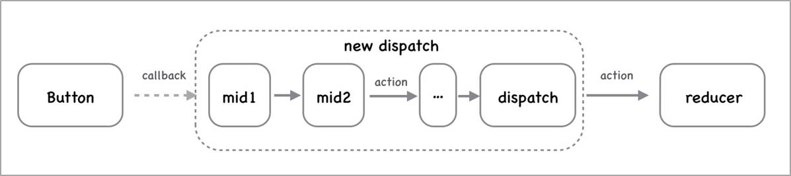

# Redux 中间件

## 中间件概述

**目标：** 能够理解为什么需要redux中间件

**内容：**

默认情况下，Redux 自身只能处理同步数据流。但是在实际项目开发中，状态的更新、获取，通常是使用异步操作来实现

- 问题：如何在 Redux 中进行异步操作呢? 
- 回答：通过 Redux 中间件机制来实现

Redux 中间件作用：**处理具有副作用（side effect）的功能**，比如，异步操作就是最常见的 side effect

中间件说明：

- 中间件，可以理解为处理一个功能的中间环节
- 下图中，自来水从水库到用户家庭中的每一个环节都是一个中间件
- 中间件的优势：可以串联、组合，在一个项目中使用多个中间件
- **Redux 中间件用来处理 状态 更新，也就是在 状态 更新的过程中，执行一系列的相应操作**


## 中间件的触发时机

**目标**：能够理解中间件的触发时机

**内容**：

- Redux 中间件执行时机：**在 dispatching action 和 到达 reducer 之间**
- 没有中间件：`dispatch(action) => reducer`


- 使用中间件：`dispatch(action) => 执行中间件代码 => reducer`



- 中间件原理：封装了 redux 自己的 dispatch 方法
  - 没有中间件：`store.dispatch()` 就是 Redux 库自己提供的 dispatch 方法，用来发起状态更新
  - 使用中间件：`store.dispatch()` 就是中间件封装处理后的 dispatch，但是，最终一定会调用 Redux 自己的 dispatch 方法发起状态更新

## redux-logger中间件

**目标**：能够使用redux-logger中间件记录日志

**步骤**：

1. 安装：`yarn add redux-logger`
2. 导入 redux-logger 中间件
3. 从 redux 中导入 `applyMiddleware` 函数
4. 调用 applyMiddleware() 并传入 logger 中间件作为参数
5. 将 applyMiddleware() 调用作为 createStore 函数的第二个参数

然后，调用 store.dispatch() 查看 console 中 logger 中间件记录的日志信息

**核心代码**：

store/index.js 中：

```js
import { createStore, applyMiddleware } from 'redux'
import logger from 'redux-logger'
import rootReducer from './reducers'

const store = createStore(rootReducer, applyMiddleware(logger))
```

## redux-thunk中间件

**目标**：能够使用redux-thunk中间件处理异步操作

**内容**：

`redux-thunk` 中间件可以处理`函数形式的 action`。因此，在函数形式的 action 中就可以执行异步操作

语法：

- thunk action 是一个函数
- 函数包含两个参数：1 dispatch 2 getState

```js
// 函数形式的 action
const thunkAction = () => {
  return (dispatch, getState) => {}
}

// 解释：
const thunkAction = () => {
  // 注意：此处返回的是一个函数，返回的函数有两个参数：
	// 第一个参数：dispatch 函数，用来分发 action
  // 第二个参数：getState 函数，用来获取 redux 状态
  return (dispatch, getState) => {
    setTimeout(() => {
      // 执行异步操作
      // 在异步操作成功后，可以继续分发对象形式的 action 来更新状态
    }, 1000)
  }
}
```

使用 `redux-thunk` 中间件前后对比：

1. 不使用 redux-thunk 中间件，action 只能是一个对象

```js
// 1 普通 action 对象
{ type: 'counter/increment' }
dispatch({ type: 'counter/increment' })

// 2 action creator
const increment = payload => ({ type: 'counter/increment', payload })
dispatch(increment(2)) // increment(2) => { type: 'counter/increment', payload: 2 }
```

2. **使用 redux-thunk 中间件后，action 既可以是对象，又可以是函数**

```js
// 1 对象：
// 使用 action creator 返回对象
const increment = payload => ({ type: 'counter/increment', payload })
// 分发同步 action
dispatch(increment(2)) // => dispatch({ type: 'counter/increment', payload: 2 })

// 2 函数：
// 使用 action creator 返回函数
const incrementAsync = () => {
  return (dispatch, getState) => {
    // ... 执行异步操作代码
    setTimeout(() => {}, 2000)
  }
}
// 分发异步 action
dispatch(incrementAsync())
```

**步骤**：

1. 安装：`yarn add redux-thunk`
2. 导入 redux-thunk
3. 将 thunk 添加到 applyMiddleware 函数的参数（中间件列表）中
4. 创建函数形式的 action，在函数中执行异步操作

**核心代码**：

store/index.js 中：

```js
// 导入 thunk 中间件
import thunk from 'redux-thunk'
// 将 thunk 添加到中间件列表中
// 知道：如果中间件中使用 logger 中间件，logger 中间件应该出现在 applyMiddleware 的最后一个参数
const store = createStore(rootReducer, applyMiddleware(thunk, logger))
```

actions/index.js 中：

```js
export const clearAllAsync = () => {
  return (dispatch) => {
    // 处理异步的代码：1 秒后再清理已完成任务
    setTimeout(() => {
      dispatch(clearAll())
    }, 1000)
  }
}
```

App.js 中：

```jsx
import { clearTodoAsync } from '../store/actions/todos'

const TodoFooter = () => {
	return (
    // ...
  	<button
      className="clear-completed"
      onClick={() => dispatch(clearTodoAsync())}
    >
      Clear completed
    </button>
  )
}
```

## redux-devtools-extension中间件

**目标**：能够使用chrome开发者工具调试跟踪redux状态

**内容**：

-  [redux-devtools-exension 文档](https://www.npmjs.com/package/redux-devtools-extension)  
- 先给 Chrome 浏览器安装 redux 开发者工具，然后，就可以查看 Redux 状态了

**步骤**：

1. 安装： `yarn add redux-devtools-extension`
2. 从该中间件中导入 composeWithDevTools 函数
3. 调用该函数，将 applyMiddleware() 作为参数传入
4. 打开 Chrome 浏览器的 redux 开发者工具并使用

```jsx
import thunk from 'redux-thunk'
import { composeWithDevTools } from 'redux-devtools-extension'

const store = createStore(reducer, composeWithDevTools(applyMiddleware(thunk)))

export default store
```

## 理解Redux异步数据流

**目标**：能够说出redux的异步数据流动过程

**内容**：


从 React 组件开始  ==> Redux ==> React组件结束

1. 在 React 组件中，点击按钮，触发了按钮的点击事件
2. 在点击事件中，我们通过 `dispatch( thunk action )` 分发了一个 thunk action（异步操作）
3. thunk 中间件就会调用 thunk action，调用的时候，会传入：dispatch 和 getState 两个参数
4. 然后，执行 thunk action 中的异步代码
5. 异步代码执行完成后，我们可以继续调用 `dispatch( 对象形式的action )`
6. 当我们调用 dispatch 函数时，Redux 就会调用 reducer，调用方式：`reducer(redux自己维护的状态, dispatch时的action)`
7. reducer 根据上一次的状态（state） 以及 当前要执行的动作（action），来计算出一个新的状态，并且返回这个新状态
8. Redux 内部拿到这个新的状态，用这个状态来作为最新 Redux 状态值
9. 由于 Redux 状态发生改变，所以，会通知 React 组件，来重新渲染 React 组件
10. React 组件重新渲染，就会重新执行组件中的代码，这样，就可以拿到最新的 Redux 状态，从而来更新组件内容

## 了解：redux-thunk中间件原理

**目标**：能够了解redux-thunk中间件的原理

**内容**：

- [redux-thunk@v2.3 源码链接](https://github.com/reduxjs/redux-thunk/blob/v2.3.0/src/index.js)

```js
// thunk 中间件的核心代码：

const thunk = ({ dispatch, getState }) => next => action => {
  // thunk 中间件会判断 action 是不是一个函数
  if (typeof action === 'function') {
    // 如果 action 是函数，就直接调用 action
    return action(dispatch, getState);
  }

  // 继续调用下一个中间件
  return next(action);
};

// ---

// 我们自己创建的 thunk action 代码
const toggleState = (id, goods_state) => {
  // thunk action
  return async (dispatch, getState) => {
    await axios.patch(`http://localhost:8888/cart/${id}`, {
      goods_state,
    })

    // 修改本地购物车数据
    dispatch({
      type: 'cart/toggle',
      // 传递额外的数据
      payload: {
        id,
        goods_state,
      },
    })
  }
}
```


```js
function createThunkMiddleware(extraArgument) {
  // Redux 中间件的写法：const myMiddleware = store => next => action => { /* 此处写 中间件 的代码 */ }
  return ({ dispatch, getState }) => (next) => (action) => {
    // redux-thunk 的核心代码：
    // 判断 action 的类型是不是函数
    
    // 如果是函数，就调用该函数（action），并且传入了 dispatch 和 getState
    if (typeof action === 'function') {
      return action(dispatch, getState, extraArgument);
    }
    
    // 如果不是函数，就调用下一个中间件（next），将 action 传递过去
    // 如果没有其他中间件，那么，此处的 next 指的就是：Redux 自己的 dispatch 方法
    return next(action);
  };
}

// 所以，在使用了 redux-thunk 中间件以后，那么，redux 就既可以处理 对象形式的 action 又可以处理 函数形式的 action 了
// 1 处理对象形式的 action
dispatch({ type: 'todos/clearAll' }) // 对应上面第 14 行代码

// 2 处理函数型的 action
export const clearAllAsync = () => {
  return dispatch => {
    // 在此处，执行异步操作
    setTimeout(() => {
      // 异步操作完成后，如果想要修改 redux 中的状态，就必须要
      // 分发一个 对象形式的 action（同步的 action）
      dispatch({ type: types.CLEAR_ALL })
    }, 1000)
  }
}
dispatch(clearAllAsync()) // 对应上面第 8、9 行代码
```

## 了解：redux 中间件原理

- Redux 中间件原理：创建一个函数，**包装 store.dispatch**，使用新创建的函数作为新的 dispatch
- 比如下图，logger 就是一个中间件，使用该中间件后 store.dispatch 就是包装后的新 dispatch
- 中间件修改了 store.dispatch，在分发动作和到达 reducer 之间提供了扩展
- redux 中间件采用了 **洋葱模型** 来实现

- [参考资料：两种中间件模型](https://www.jianshu.com/p/70fb2405b281)

<figure class="third">
  
  
</figure>

- 自己实现记录日志的 redux 中间件：

```js
const logger = store => next => action => {
  console.log('prev state:', store.getState()) // 更新前的状态
  // 记录日志代码
  console.log('dispatching', action)
  let result = next(action)
  console.log('next state', store.getState()) // 更新后的状态
  return result
}

// 简化写法：
// store 表示：redux 的 store
// next 表示：下一个中间件，如果只使用一个中间，那么 next 就是 store.dispatch（redux 自己的 dispatch 函数）
// action 表示：要分发的动作
const logger = store => next => action => {
  console.log('prev state:', store.getState()) // 更新前的状态
  // 记录日志代码
  console.log('dispatching', action)
  // 如果只使用了一个中间件：
  // 那么，next 就表示原始的 dispatch
  // 也就是：logger中间件包装了 store.dispatch
  let result = next(action)
  // 上面 next 代码执行后，redux 状态就已经更新了，所以，再 getState() 拿到的就是更新后的最新状态值
  // 记录日志代码
  console.log('next state', store.getState()) // 更新后的状态
  return result
}

// 完整写法：
const logger = store => {
  return next => {
    return action => {
      // 中间件代码写在这个位置：
    }
  }
}
```
