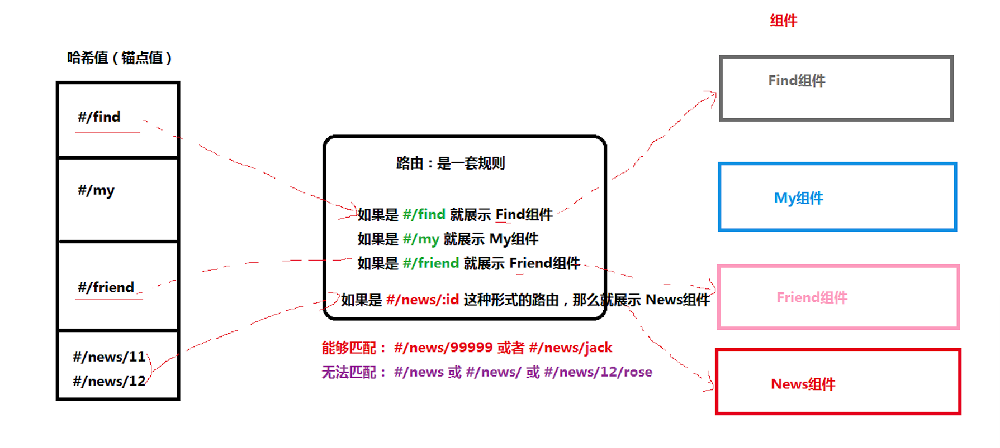

# React 路由

- React 路由介绍
- 路由的基本使用
- 路由的执行过程
- 路由的常用操作

## React 路由介绍

现代的前端应用大多都是 SPA（单页应用程序），也就是只有一个 HTML 页面的应用程序。因为它的用户体验更好、对服务器的压力更小，所以更受欢迎。为了**有效的使用单个页面来管理原来多页面的功能，前端路由应运而生**。前端路由的功能：让用户从一个视图（页面）导航到另一个视图（页面）

- 前端路由是一套**映射规则**，在React中，是 *URL路径* 与 *组件* 的对应关系 
- 使用 React 路由简单来说就是：配置路径和组件（配对）




## 路由基本使用

**目标**：能够使用 react 路由切换页面

**内容**：

react router 目前主要有两个版本在使用：v6 和 v5（从 v5 升级到 v6，有破坏性更新，简单来说：两个版本使用方式不同）

- [v6 文档](https://reactrouter.com/)
- [v5 文档](https://v5.reactrouter.com/)、 [v5 中文文档](https://react-router.docschina.org/web/guides/philosophy)

**步骤**：

1. 安装：`yarn add react-router-dom`
2. 导入路由的 4 个组件：Router / Routes / Route / Link
3. 使用 Router 组件包裹整个应用
4. 使用 Link 组件作为导航菜单（路由入口）
5. 使用 Routes 包裹 Route 组件，在 Route 组件上配置路由规则和要展示的组件（路由出口）

**核心代码**：

```jsx
import { BrowserRouter as Router, Routes, Route, Link } from 'react-router-dom'

const First = () => <p>页面一的页面内容</p>

const App = () => {
  return (
    <Router>
      <div className="App">
        <ul>
          <li>
            {/*
              to属性：浏览器地址栏中的pathname（location.pathname）
            */}
            <Link to="/first">页面一</Link>
          </li>
        </ul>
        
        <Routes>
        	{/*
            path属性：路由规则
            component属性：展示的组件
            Route 组件写在哪，渲染出来的组件就展示在哪
          */}
          <Route path="/first" component={First}></Route>
        </Routes>
      </div>
    </Router>
 	)
}
```

## Router 组件的说明

**目标**：能够知道 react 路由常用的两种模式

**内容**：

+ Router 组件：包裹整个应用，一个 React 应用只需要使用一次
+ 两种常用 Router：`HashRouter` 和 `BrowserRouter`  
+ HashRouter：使用 URL 的哈希值实现（http://localhost:3000/#/first）
  - 原理：监听 window 的 `hashchange` 事件来实现的
+ （推荐）**BrowserRouter**：使用 H5 的 history.pushState() API 实现（http://localhost:3000/first）
  - 原理：监听 window 的 `popstate` 事件来实现的

## Link组件的说明

**目标**：能够使用 Link 组件实现路由跳转

**内容**：

`Link` 组件：用于指定导航链接，会渲染成 a 标签

+ `to` 属性，将来会渲染成 a 标签的 href 属性

```jsx
<Link to="/first">页面一</Link> // 渲染为： <a href="/first">页面一</a>
```

## Routes 组件的说明

**目标**：能够知道 Routes 组件的作用

**内容**：

当 location 改变时，`<Routes>` 组件会查看其所有的 `<Route>` 子节点，找到最匹配的规则，然后渲染 element 指定的内容

## Route组件的说明

**目标**：能够使用 Route 组件配置路由规则

**内容**：

`Route` 组件：用来配置路由规则

- `path` 属性，指定路由规则
- `element` 属性，指定要渲染的组件

```jsx
// 使用 element 属性指定要渲染的组件
<Route path="/search" element={Search} />
```

注意：对于 Route 来说，如果路由规则匹配成功，就会渲染对应组件；否则，渲染 null 或者说不渲染任何内容（类似于 `if`）

## 路由的执行过程

**目标**：能够说出 react 路由切换页面的执行过程

**内容**：

切换页面时，执行过程如下：

1. 点击 Link 组件（a标签），修改了浏览器地址栏中的 url
2. React 路由监听到地址栏 url 的变化  hashchange / popstate
3. React 路由内部遍历所有 Route 组件，使用路由规则（path）与 pathname（hash）进行匹配
4. 当路由规则（path）能够匹配地址栏中的 pathname（hash） 时，展示该 Route 组件的内容

## 未匹配路由与404页面

**目标**：能够通过路由配置 404 页面

**内容**：

```jsx
import {
  BrowserRouter,
  Routes,
  Route,
} from "react-router-dom"

const App = () => {
	return (
  	<BrowserRouter>
      <Routes>
        <Route path="/" element={<App />} />
        <Route path="expenses" element={<Expenses />} />
        <Route path="invoices" element={<Invoices />} />
        
        {/* 当前面所有路由规则都不匹配时，就会匹配该路由 */}
        <Route
          path="*"
          element={
            <main style={{ padding: "1rem" }}>
              <p>你访问的页面不存在，404！</p>
            </main>
          }
        />
      </Routes>
    </BrowserRouter>
  )
}
```

## 编程式导航

**目标**：能够按钮的点击事件中跳转路由

**内容**：

+  场景：点击登录按钮，登录成功后，通过代码跳转到后台首页，如何实现？
+  编程式导航：通过 JS 代码来实现页面跳转
+  `useNavigate` hook 返回一个函数，该函数允许你以编程方式导航
   +  `navigate('/a')`
   +  `navigate('/a', { replace: true })`
   +  `navigate(-1)` 返回上一页


```jsx
import { useNavigate } from 'react-router-dom'

const Login = () => {
  const navigate = useNavigate()
  
	const onLogin = () => {
    // ...
    navigate('/home')
  }
  return (
  	<button onClick={onLogin}>登录</button>
  )
}
```

切换路由的两种模式：

1. push 模式：`navigate(path)`
2. replace 模式：`navigate(path, { replace: true })`

两种模式的区别为：

浏览器会自动记录访问过来的页面路径，可以简单的把理解为通过一个 数组 来记录的。

比如：我们访问了 3 个页面：['/login', '/home', '/search']，当前所在页面为：'/search'

1. 此时，如果我们又通过 `navigate('/a')` 方法访问了一个新页面：'/a'，此时，就相当于往数组中 push 了一条数据，
   - 那么，访问该页面后，浏览器中的记录为：['/login', '/home', '/search', '/a']

2. 此时，如果我们又通过 `navigate('/a', { replace: true })` 方法访问了一个新页面：'/a'，此时，就相当于把当前页面地址，替换为 '/a'
   - 那么，访问该页面后，浏览器中的记录为：['/login', '/home', '/a']

