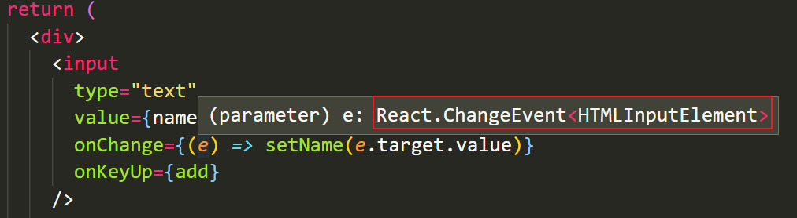

# TypeScript 常用类型


[在线运行 TypeScript](https://www.typescriptlang.org/play?#code/Q)

## 类型注解

**目标：**能够理解ts的类型注解

**内容：**

示例代码：

```ts
let age: number = 18
```

- 说明：代码中的 `: number` 就是**类型注解**
- 作用：**为变量添加类型约束**。比如，上述代码中，约定变量 age 的类型为 number 类型
- 解释：**约定了什么类型，就只能给变量赋值该类型的值，否则，就会报错**

```ts
// 错误演示

// 错误原因：将 string 类型的值赋值给了 number 类型的变量，类型不一致
let age: number = '18'
```

## 原始类型

**目标：**能够理解ts中原始类型的使用

**内容：**

可以将 TS 中的常用基础类型细分为两类：1 JS 已有类型 2 TS 新增类型

1. JS 已有类型

   - 原始类型：`number/string/boolean/null/undefined/symbol`

   - 对象类型：`object`（包括，数组、对象、函数等对象）

2. TS 新增类型
   - 联合类型、自定义类型(类型别名)、接口、元组、字面量类型、枚举、void、any 等
   - 注意：
     - *原始类型*在 TS 和 JS 中写法一致
     - *对象类型*在 TS 中更加细化，每个具体的对象（比如，数组、对象、函数）都有自己的类型语法

首先，我们先来看原始类型：

- 原始类型：number/string/boolean/null/undefined/symbol
- 特点：简单，这些类型，完全按照 JS 中类型的名称来书写

```ts
let age: number = 18
let myName: string = '黑马程序员'
let isLoading: boolean = false
let nullValue: null = null
let undefinedValue: undefined = undefined
let uniqKey: symbol = Symbol()

// ---

// 特点：Symbol() 创建的值是唯一的
// 作用：可以作为对象属性的键，防止与对象中其他键冲突
let uniqKey: symbol = Symbol()

let obj = {
  a: '123'
}
obj.a = ''
// 为 obj 对象添加属性，并且还要保证属性名一定不会重复
let uniqKey = Symbol()
obj[uniqKey] = ''

// 取值：
console.log( obj[uniqKey] )

// 等等...
```

##  数组类型

**目标：**能够为数组指定类型

**内容：**

- 数组类型有以下两种写法，推荐使用 `number[]` 写法

```ts
// 写法一：（推荐）
let numbers: number[] = [1, 3, 5]

// 写法二：
let strings: Array<string> = ['a', 'b', 'c']
```

## 联合类型

**目标：**能够通过联合类型将多个类型组合成一个类型

**内容：**

需求：数组中既有 number 类型，又有 string 类型，这个数组的类型应该如何写?

```ts
// 此处 () 的目的是为了将提升优先级，表示：number 类型的数组或 string 类型的数组
let arr: (number | string)[] = [1, 'a', 3, 'b']
```

- 解释：`|`（竖线）在 TS 中叫做**联合类型**，即：由两个或多个其他类型组成的类型，表示可以是这些类型中的任意一种
- 注意：这是 TS 中联合类型的语法，**只有一根竖线**，不要与 JS 中的或（|| 或）混淆了

```ts
// 思考：该类型的含义？
let arr: number | string[]
```

## 类型别名

**目标：**能够使用类型别名给类型起别名

**内容：**

- `类型别名（自定义类型）`：为任意类型起别名
- 使用场景：当同一类型（复杂）被多次使用时，可以通过类型别名，**简化该类型的使用**

```ts
type CustomArray = (number | string)[]

let arr1: CustomArray = [1, 'a', 3, 'b']
let arr2: CustomArray = ['x', 'y', 6, 7]
```

- 解释:
  1. 使用 `type` 关键字来创建自定义类型
  2. 类型别名（比如，此处的 *CustomArray*）可以是任意合法的变量名称
  3. 推荐使用大写字母开头
  4. 创建类型别名后，直接使用该类型别名作为变量的类型注解即可

练习：

```ts
// 创建一个自定义数组类型，数组元素可以是：布尔值 或 字符串数组
```

---

## 函数类型

### 参数和返回值类型

**目标：**能够给函数指定类型

**内容：**

- 函数的类型实际上指的是：`函数参数`和`返回值`的类型
- 为函数指定类型的两种方式：
  1. 单独指定参数、返回值的类型
  2. 同时指定参数、返回值的类型

1. 单独指定参数、返回值的类型：

```ts
// 函数声明
function add(num1: number, num2: number): number {
  return num1 + num2
}

// 箭头函数
const add = (num1: number, num2: number): number => {
  return num1 + num2
}
```

2. 同时指定参数、返回值的类型:
   - 解释：当函数作为表达式时，可以通过类似箭头函数形式的语法来为函数添加类型
   - 注意：这种形式只适用于函数表达式

```ts
// 创建函数自定义类型
type AddFn = (num1: number, num2: number) => number

// 使用自定义类型作为函数 add 的类型
const add: AddFn = (num1, num2) => {
  return num1 + num2
}
```

### void 类型

**目标：**能够了解void类型的使用

**内容：**

- 如果函数没有返回值，那么，函数返回值类型为：`void`

```ts
function greet(name: string): void {
  console.log('Hello', name)
}
```

- 注意：如果一个函数没有返回值，此时，在 TS 的类型中，应该使用 `void` 类型
- 注意：不要与 undefined 类型混淆

```ts
// 如果什么都不写，此时，add 函数的返回值类型为： void
const add = () => {}
// 这种写法是明确指定函数返回值类型为 void
const add = (): void => {}


// 但，如果指定 返回值类型为 undefined，此时，函数体中必须显示的 return undefined 才可以
const add = (): undefined => {
  // 此处，返回的 undefined 是 JS 中的一个值
  return undefined
}
```

### 可选参数

**目标：**能够给函数设置可选参数类型

**内容：**

- 使用函数实现某个功能时，参数可以传也可以不传。这种情况下，在给函数参数指定类型时，就用到**可选参数**了
- 比如，数组的 slice 方法，可以 `slice()` 也可以 `slice(1)` 还可以 `slice(1, 3)`

```ts
function mySlice(start?: number, end?: number): void {
  console.log('起始索引：', start, '结束索引：', end)
}
```

- 可选参数：在可传可不传的参数名称后面添加 `?`（问号）
- 注意：**可选参数只能出现在参数列表的最后**，也就是说可选参数后面不能再出现必选参数
- 注意：参数默认值和可选参数互斥的，一般只需要指定一种即可
  - 注意：如果参数有默认值，那么该参数默认就是可选的

```ts
// 此处的 state 是一个默认参数，TS 会自动将其解析为 可选参数
const reducer = (state = 0) => {
  return state
}
```

```ts
// 创建一个函数，用来计算两个或三个数字的和
// 调用演示：
// 	add(2, 3) 		// => 5
//  add(2, 3, 4) 	// => 9
```

---

## 对象类型

**目标：**掌握对象类型的基本使用

**内容：**

- JS 中的对象是由属性和方法构成的，而 **TS 对象的类型就是在描述对象的结构**（有什么类型的属性和方法）
- 对象类型的写法:

```ts
// 空对象
let person: {} = {}

// 有属性的对象
let person: { name: string } = {
  name: '黑马程序员'
}

// 既有属性又有方法的对象
// 在一行代码中指定对象的多个属性类型时，使用 `;`（分号）来分隔
let person: { name: string; sayHi(name: string): void } = {
  name: 'jack',
  sayHi(name) {}
}

// 对象中如果有多个类型，可以换行写：
// 通过换行来分隔多个属性类型，可以去掉 `;`
let person: {
  name: string
  sayHi(): void
} = {
  name: 'jack',
  sayHi() {}
}
```

- 解释：
  1. 使用 `{}` 来描述对象结构
  2. 属性采用`属性名: 类型`的形式
  3. 方法采用`方法名(参数: 参数的类型): 返回值类型`的形式

### 使用类型别名指定类型

- 注意：直接使用 `{}` 形式为对象添加类型，会降低代码的可读性（不好辨识类型和值）
- 推荐：**使用类型别名为对象添加类型**

```ts
// 创建类型别名
type Person = {
  name: string
  sayHi(): void
}

// 使用类型别名作为对象的类型：
let person: Person = {
  name: 'jack',
  sayHi() {}
}
```

### 带有参数的方法类型

- 如果方法有参数，就在方法名后面的小括号中指定参数类型

```ts
type Person = {
  greet(name: string): void
}

let person: Person = {
  greet(name) {
    console.log(name)
  }
}
```

### 箭头函数形式的方法类型

- 方法的类型也可以使用箭头函数形式

```ts
type Person = {
  greet: (name: string) => void
}

let person: Person = {
  greet(name) {
    console.log(name)
  }
}
```

### 对象可选属性

- 对象的属性或方法，也可以是可选的，此时就用到**可选属性**了
- 比如，我们在使用 `axios({ ... })` 时，如果发送 GET 请求，method 属性就可以省略
- 可选属性的语法与函数可选参数的语法一致，都使用 `?` 来表示

```ts
type Config = {
  url: string
  method?: string
}

function myAxios(config: Config) {
  console.log(config)
}
```

### 练习

```ts
// 创建一个对象：学生对象，该对象中具有以下属性和方法：
//	1 属性：
//			比选属性：姓名、性别、成绩
//			可选属性：身高
// 	2 方法：学习、打游戏（可选）
```

### 接口

**目标**：能够使用接口类型来为对象指定类型

**内容**：

当一个对象类型被多次使用时，也可以使用接口（`interface`）来描述对象的类型，达到复用的目的

解释：
- 使用 `interface` 关键字来声明接口

- 接口名称(比如，此处的 IPerson)，可以是任意合法的变量名称

- 声明接口后，直接使用接口名称作为变量的类型

- 因为每一行只有一个属性类型，因此，属性类型后没有 `;`(分号)

```ts
interface Person {
  name: string
  age: number
  sayHi(): void
}

let person: Person = {
  name: 'jack',
  age: 19,
  sayHi() {}
}
```

### interface vs type

**目标**：能够理解interface和type的相同点和不同点

**内容**：

interface（接口）和 type（类型别名）的对比：

- 相同点：都可以给对象指定类型
- 不同点:
  - 接口，只能为对象指定类型
  - 类型别名，不仅可以为对象指定类型，实际上可以为任意类型指定别名

注意：interface 和 type 在使用上还有其他的不同之处，请[参考文档](https://www.typescriptlang.org/docs/handbook/2/everyday-types.html#differences-between-type-aliases-and-interfaces)说明

约定：**能使用 type 就是用 type**

```ts
interface IPerson {
  name: string
  age: number
  sayHi(): void
}

// 为对象类型创建类型别名
type IPerson = {
  name: string
  age: number
  sayHi(): void
}

// 为联合类型创建类型别名
type NumStr = number | string
```

### 接口继承

**目标**：能够通过接口继承实现复用

**内容**：

如果两个接口之间有相同的属性或方法，可以将**公共的属性或方法抽离出来，通过继承来实现复用**

比如，这两个接口都有 x、y 两个属性，重复写两次，可以，但很繁琐

```ts
interface Point2D { x: number; y: number }
interface Point3D { x: number; y: number; z: number }
```

使用接口继承，来简化：

1. 使用 `extends`(继承)关键字实现了接口 Point3D 继承 Point2D
2. 继承后，Point3D 就有了 Point2D 的所有属性和方法(此时，Point3D 同时有 x、y、z 三个属性)

```ts
interface Point2D { x: number; y: number }
// 继承 Point2D
interface Point3D extends Point2D {
  z: number
}

// 继承后 Point3D 的结构：{ x: number; y: number; z: number }
```

对象类型的总结：

1. 对象类型的写法，对象类型实际上就是在描述对象的接口
2. 推荐使用 type 来指定对象的类型

```ts
type Person = {
  name: string
  age: number
  sayHi?: () => void
}

let obj: Person = {
  name: '黑马程序员',
  age: 18
}
```

## 交叉类型

**目标**：能够使用交叉类型模拟接口继承的功能

**内容**：

- 语法：`&`，交叉类型（intersection types）
- 作用：组合现有的对象类型
- 比如，Point3D 组合了 Point2D 和 后面的对象，所以，Point3D 就同时具有了 Point2D 和 后面对象中的所有属性

```ts
// 使用 type 自定义类型来模拟 Point2D 和 Point3D
type Point2D = {
  x: number
  y: number
}

// 使用 交叉类型 来实现接口继承的功能：
// 使用 交叉类型 后，Point3D => { x: number; y: number; z: number }
// 也就是同时具有了 Point2D 和 后面对象 的所有的属性了
type Point3D = Point2D & {
  z: number
}

let o: Point3D = {
  x: 1,
  y: 2,
  z: 3
}
```

## 类型推论

**目标**：能够知道什么是TS的类型推论

**内容**：

- 在 TS 中，某些没有明确指出类型的地方，**TS 的类型推论机制会帮助提供类型**
- 换句话说：由于类型推论的存在，这些地方，**类型注解可以省略不写**
- 发生类型推论的 2 种常见场景：
  1. 声明变量并初始化时
  2. 决定函数返回值时

```ts
// 变量 age 的类型被自动推断为：number
let age = 18

// 函数返回值的类型被自动推断为：number
// 注意：函数参数一定要添加类型
function add(num1: number, num2: number) {
  return num1 + num2
}
```

- 推荐：**能省略类型注解的地方就省略**（~~偷懒~~，充分利用TS类型推论的能力，提升开发效率）
- 技巧：如果不知道类型，可以通过鼠标放在变量名称上，利用 VSCode 的提示来查看类型
- 推荐：在 VSCode 中写代码的时候，多看方法、属性的类型，养成写代码看类型的习惯（充分发挥 VSCode 的能力）

## any 类型

**目标**：能够知道TS中的any类型

**内容**：

- **原则：不推荐使用 any**！这会让 TypeScript 变为 “AnyScript”（失去 TS 类型保护的优势）
- 解释：因为当值的类型为 any 时，可以对该值进行任意操作，并且不会有代码提示

```ts
let obj: any = { x: 0 }

obj.bar = 100
obj()
const n: number = obj
```

尽可能的避免使用 any 类型，除非临时使用 any 来“避免”书写很长、很复杂的类型

其他隐式具有 any 类型的情况

1. 声明变量不提供类型也不提供默认值

2. 函数参数不加类型

注意：因为不推荐使用 any，所以，这两种情况下都应该提供类型  

---

# TypeScript 应用

## 泛型概述

**目标**：能够知道泛型的作用

**内容**：

- **泛型（Generics）可以在保证类型安全前提下，让函数等与多种类型一起工作，从而实现复用**，常用于：函数、接口、class 中
- 需求：创建一个 id 函数，传入什么数据就返回该数据本身（也就是说，参数和返回值类型相同）

```ts
// 比如，该函数传入什么数值，就返回什么数值
function id(value: number): number { return value }

// res => 10
const res = id(10)
```

- 比如，id(10) 调用以上函数就会直接返回 10 本身。但是，该函数只接收数值类型，无法用于其他类型
- 为了能让函数能够接受任意类型的参数，可以将参数类型修改为 any。但是，这样就失去了 TS 的类型保护，类型不安全

```ts
function id(value: any): any { return value }
```

- 这时候，就可以使用**泛型**来实现了
- **泛型在保证类型安全(不丢失类型信息)的同时，可以让函数等与多种不同的类型一起工作，灵活可复用**
- 实际上，在 C# 和 Java 等编程语言中，泛型都是用来实现可复用组件功能的主要工具之一

### 泛型函数

**目标**：能够使用泛型创建一个基本的泛型函数

**内容**：

创建泛型函数：

```ts
function id<Type>(value: Type): Type { return value }

// 也可以仅使用一个字母来作为类型变量的名称
function id<T>(value: T): T { return value }
```

解释：

- 语法：在函数名称的后面添加 `<>`（尖括号），**尖括号中添加类型变量**，比如此处的 Type

- **类型变量 Type，是一种特殊类型的变量，它处理类型而不是值**

- **类型变量相当于一个类型容器**，能够捕获用户提供的类型（具体是什么类型由用户调用该函数时指定）

- 因为 Type 是类型，因此可以将其作为函数参数和返回值的类型，表示参数和返回值具有相同的类型

- 类型变量 Type，可以是任意合法的变量名称

调用泛型函数：

```ts
// 函数参数和返回值类型都为：number
const num = id<number>(10)

// 函数参数和返回值类型都为：string
const str = id<string>('a')
```

解释：

- 语法：在函数名称的后面添加 `<>`（尖括号），**尖括号中指定具体的类型**，比如，此处的 number

- 当传入类型 number 后，这个类型就会被函数声明时指定的类型变量 Type 捕获到

- 此时，Type 的类型就是 number，所以，函数 id 参数和返回值的类型也都是 number

- 这样，通过泛型就做到了让 id 函数与多种不同的类型一起工作，**实现了复用的同时保证了类型安全**

### 简化泛型函数调用

**目标**：能够知道在调用泛型函数时可以省略尖括号

**内容**：

在调用泛型函数时，**可以省略 `<类型>` 来简化泛型函数的调用**

```ts
// 省略 <number> 调用函数
let num = id(10)
let str = id('a')
```

解释：

- 此时，TS 内部会采用一种叫做**类型参数推断**的机制，来根据传入的实参自动推断出类型变量 Type 的类型
- 比如，传入实参 10，TS 会自动推断出变量 num 的类型 number，并作为 Type 的类型
- 推荐：使用这种简化的方式调用泛型函数，使代码更短，更易于阅读
- 说明：**当编译器无法推断类型或者推断的类型不准确时，就需要显式地传入类型参数**

---

## 创建基于TS的React项目

**目标**：能够使用CRA创建基于TS的项目

**内容**：

创建基于 TS 的 React 项目命令：`npx create-react-app react-ts --template typescript` 

说明：在命令行中，添加 `--template typescript` 表示创建支持 TS 的项目

相比 JS 的 React 项目，目录的变化：

1. 在项目根目录中多了一个文件：`tsconfig.json`（TS 的配置文件）
2. 在 src 目录中，文件的后缀有变化，由原来的 .js 变为 `.ts` 或 `.tsx`   
   - `.ts` ts 文件的后缀名
   - `.tsx` 是在 TS 中使用 React 组件时的后缀。只要代码中出现 JSX 结构，就得使用该后缀
3. 在 src 目录中，多了 `react-app-env.d.ts` 文件
   - `.d.ts` 类型声明文件，用来指定类型
   - 注意：不要动 src/react-app-env.d.ts 文件！！！

```ts
// TS 中的 三斜线指令，作用类似于 import 用于指定对其他类型声明文件的依赖关系

// 此处，通过 types 来声明依赖于 react-scripts 包
// https://www.typescriptlang.org/docs/handbook/triple-slash-directives.html#-reference-types-
/// <reference types="react-scripts" />
```

## useState 泛型函数

**目标**：能够掌握useState在TS中的使用

**内容：**

+ `useState` hook 是一个泛型函数，接收一个类型变量来指定状态的类型

```tsx
// 指定 name 状态的类型为：string
const [name, setName] = useState<string>('jack')
// 指定 age 状态的类型为：number
const [age, setAge] = useState<number>(28)
```

+ 注意：该类型变量，不仅指定了状态的类型，也指定了 setName 等修改状态函数的参数类型

```tsx
const [name, setName] = useState<string>('jack')
// 此时，setName 的参数的类型也是 string
setName('rose')
// 错误演示：
// setName(18)
```

省略类型变量，简化 `useState` 的调用：

+ 在使用 useState 时，只要提供了初始值，TS 就会自动根据初始值来推断出其类型，因此，可以省略类型变量

```tsx
const [name, setName] = useState('jack')
```

*注意：如果 TS 自动推断出来的类型不准确，就需要明确指定泛型类型*

## useState 明确指定泛型类型

**目标：**能够明确指定useState的泛型类型

**内容：**

- 需求：获取频道列表数据并渲染
  + 频道列表数据的接口：http://geek.itheima.net/v1_0/channels


```jsx
// 比如，频道列表数据是一个数组，所以，在 JS 中我们将其默认值设置为：[]
// 但是，在 TS 中使用时，如果仅仅将默认值设置为空数组，list 的类型被推断为：never[]，此时，无法往数组中添加任何数据
const [list, setList] = useState([])
```


- 注意：**useState 的状态是数组、对象等复杂的数据类型，需要明确指定泛型类型**
  - 虽然都是数组、对象，但是，项目开发中不同需求所需要的数组结构、对象结构是不同的。因此，需要明确指定其类型

```ts
type Channel = {
  id: number
  name: string
}
// 明确指定状态的类型，此时，list 的类型为：Channel[]
// Channel[] 表示 Channel 类型的数组，也就是，数组中只能出现 Channel 类型的数据
const [list, setList] = useState<Channel[]>([])
```

**总结**：

- 使用 TS 时，应该以类型化思维来写代码，简单来说：**先有类型，再写逻辑代码来使用该类型的数据**
- 比如，对于 对象、数组 来说，就应该在使用前先明确指定要用到的对象的类型、数组的类型等等

练习：

```ts
// 假设，有以下学生信息，使用 useState 来存储该信息，并展示
{ name, age, grade }

// 模拟获取学生信息
useEffect(() => {
  setTimeout(() => {
    setStudent({
      name: '张三',
      age: 13,
      grade: 3
    })
  }, 0)
}, [])
```

## Redux + TS

**目标：**能够掌握如何在TS项目中初始化redux

**内容：**

+ 安装依赖包：`yarn add react-redux @reduxjs/toolkit`

+ 新建文件 store/index.ts（ 后缀为 `.ts` ）

```jsx
import { configureStore } from '@reduxjs/toolkit'
import cart from './slices/cart'

const store = configureStore({
  reducer: {
    cart,
  },
})

export default store
```

+ 新建文件 store/slices/todos.ts

```ts
type TodoList = {
  id: number
  text: string
  done: boolean
}
const initialState: TodoList = [
  {
    id: 1,
    text: '吃饭',
    done: false,
  },
  {
    id: 2,
    text: '睡觉',
    done: true,
  },
  {
    id: 3,
    text: '打豆豆',
    done: false,
  }
]

const todos = createSlice({
  name: 'todos',
  initialState,
})

export default cart.reducer
```

+ index.tsx中

```tsx
import ReactDOM from 'react-dom/client'
import { Provider } from 'react-redux'

import App from './App'
import store from './store'

const root = ReactDOM.createRoot(document.querySelector('#root') as HTMLElement)

root.render(
  <Provider store={store}>
    <App />
  </Provider>
)
```

### useSelector 的使用

**目标：**能够掌握useSelector在TS中的使用

**内容**：

+ `useSelector` hook 是一个泛型函数，接收两个类型变量，分别来指定：
1. 第一个类型变量：指定 Redux 仓库 state 的类型
  
2. 第二个类型变量：指定要获取状态的类型

1. 指定泛型类型

```ts
// 比如，可以这样调用：
type RootState = { count: number }
const count = useSelector<RootState, number>(state => state.count)
```

2. 不指定泛型类型，只指定回调函数参数 state 的类型
   - [react-redux 指定 useSelecotor 的类型](https://react-redux.js.org/using-react-redux/usage-with-typescript#typing-the-useselector-hook)

```jsx
type RootState = { count: number }
const count = useSelector((state: RootState) => state.count)
```

3. 创建自定义 hook，在自定义 hook 中指定状态类型
   - [参考：react-redux 文档 - 定义带类型的 Hooks](https://react-redux.js.org/using-react-redux/usage-with-typescript#define-typed-hooks)

```tsx
import { TypedUseSelectorHook, useSelector } from 'react-redux'
// import type { RootState, AppDispatch } from './store'

type RootState = { count: number }
export const useAppSelector: TypedUseSelectorHook<RootState> = useSelector

// ---

// 使用演示：
import { useAppSelector } from '@/store/hooks'
const count = useAppSelector(state => state.count)
```

### useDispatch 的使用

**目标**：能够掌握useDispatch在TS中的使用

**内容**：

+ `typeof xxx` 用来获取 xxx 对应的 TS 的类型

```ts
type A = typeof store.getState // 获取 store.getState 函数的 TS 类型

const arr = [1, 2]
type B = typeof arr				 // 获取 arr 数组的 TS 类型
```

```ts
// 获取 dispatch 的类型
type RootDispatch = typeof store.dispatch

const useAppDispatch = () => useDispatch<RootDispatch>()
```

### 获取Redux仓库状态的类型

**目标：**能够获取Redux仓库状态的类型

**内容：**

+ 思路：`store.getState()` 可以用来获取Redux应用的状态，所以只需要获取其类型即可
  + [参考：获取Redux仓库状态类型](https://react-redux.js.org/using-react-redux/usage-with-typescript#define-root-state-and-dispatch-types)

```ts
// store/index.ts 中：

// 获取 Redux 整个仓库的状态类型：
export type RootState = ReturnType<typeof store.getState>
```

+ `ReturnType` 是一个 TS 内置的泛型工具类型，用来获取函数的返回值类型，可以直接使用

```tsx
function add(n1: number, n2: number): number {
  return n1 + n2
}

// 获取函数 add 的类型
type AddFn = typeof add
// 获取函数 add 的返回值类型
type AddFnReturnType = ReturnType<AddFn>

// 简化：直接获取 add 函数的返回值类型
type AddFnReturnType = ReturnType<typeof add>
```

更新 `useAppSelector` hook：

```tsx
import { TypedUseSelectorHook, useSelector } from 'react-redux'
// 从 store 中拿到 RootState 状态
import type { RootState } from './store'
export const useAppSelector: TypedUseSelectorHook<RootState> = useSelector
```

### React 事件对象的类型

**目标：**能够掌握如何在TS中为事件对象指定类型

**内容：**

为 JSX 标签绑定事件时，可能需要指定事件对象的类型，分两种情况：

1. 直接在 JSX 标签上写事件处理程序，此时，不需要手动指定事件对象的类型
   - 技巧：在 JSX 标签上先把事件处理程序写好，然后，鼠标移动到事件对象上面，来查看事件对象的类型



2. 如果将事件处理程序抽离出来，需要手动指定函数参数（事件对象）的类型

```tsx
const add = (e: React.KeyboardEvent<HTMLInputElement>) => {
  if (e.code === 'Enter') {
    dispatch(addTodo(name))
    setName('')
  }
}
```

### createAsyncThunk 的使用

**目标**：能够掌握createAsyncThunk在TS中的使用

**内容**：

```ts
const delTodo = createAsyncThunk('todos/del', async (id: number) => {})

type GoodsStateParams = { id: number; goods_state: boolean }
const changeGoodsState = createAsyncThunk('cart/changeGoodsState', async ({ id, goods_state }: ChangeGoodsState) => {})
```

## tsconfig的介绍

**目标**：能够知道tsconfig的作用

**内容**：

+ tsconfig.json 是 TS 项目的配置文件，可以用来指定如何编译 TS 代码等
+ 手动创建 tsconfig.json 配置文件的命令：`tsc --init`

- 说明：所有的配置项都可以通过鼠标移入的方式，来查看配置项的解释说明
- [tsconfig 文档链接](https://www.typescriptlang.org/tsconfig)

```json
{
  // 编译选项
  "compilerOptions": {
    // 生成代码的语言版本：将我们写的 TS 代码编译成哪个版本的 JS 代码
    "target": "es5",
    // 指定要包含在编译中的 library
    // https://github.com/microsoft/TypeScript/blob/90e83adb44/lib/lib.dom.iterable.d.ts
    "lib": ["dom", "dom.iterable", "esnext"],
    // 允许 ts 编译器编译 js 文件
    "allowJs": true,
    // 跳过类型声明文件的类型检查
    "skipLibCheck": true,
    // es 模块 互操作，屏蔽 ESModule 和 CommonJS 之间的差异
    "esModuleInterop": true,
    // 允许通过 import x from 'y' 即使模块没有显式指定 default 导出
    "allowSyntheticDefaultImports": true,
    // 开启严格模式
    "strict": true,
    // 对文件名称强制区分大小写
    "forceConsistentCasingInFileNames": true,
    // 为 switch 语句启用错误报告
    "noFallthroughCasesInSwitch": true,
    // 生成代码的模块化标准
    "module": "esnext",
    // 模块解析（查找）策略
    "moduleResolution": "node",
    // 允许导入扩展名为.json的模块
    "resolveJsonModule": true,
    // 是否将没有 import/export 的文件视为旧（全局而非模块化）脚本文件
    "isolatedModules": true,
    // 编译时不生成任何JS文件（只进行类型检查）
    "noEmit": true,
    // 指定将 JSX 编译成什么形式
    "jsx": "react-jsx"
  },
  // 指定允许 ts 处理的目录
  "include": ["src"]
}
```

## 类型声明文件介绍

今天几乎所有的 JavaScript 应用都会引入许多第三方库来完成任务需求。

这些第三方库不管是否是用 TS 编写的，最终都要编译成 JS 代码，才能发布给开发者使用。

我们知道是 TS 提供了类型，才有了代码提示和类型保护等机制。 

但在项目开发中使用第三方库时，你会发现它们几乎都有相应的 TS 类型，这些类型是怎么来的呢? `类型声明文件`

- **类型声明文件：用来为已存在的 JS 提供类型信息**

这样在 TS 项目中使用这些库时，就像用 TS 一样，都会有代码提示、类型保护等机制了。

除此之外，在项目开发中，**可以使用类型声明文件来存储公共类型，实现类型的复用**

- 比如，A和B两个文件中都用到了某个类型，可以将这个类型放到类型声明文件中，从而实现复用

### TS 的两种文件类型

**目标**：能够说出 TS 中的两种文件类型

**内容**：

TS 中有两种文件类型：1 `.ts` 文件 2 `.d.ts` 文件 

- `.ts` 文件:
  1. `既包含类型信息又包含可执行代码` 
  2. 可以被编译为 .js 文件，然后，执行代码
  3. 用途：编写程序代码的地方
- `.d.ts` 文件:
  1. `只包含类型信息`的类型声明文件
  2. **不会生成 .js 文件，仅用于提供类型信息，在.d.ts文件中不允许出现可执行的代码，只用于提供类型**
  3. 用途：为 JS 提供类型信息

```ts
// 1. 在 a.d.ts 文件中，加入以下代码
// 2. 执行命令：tsc a.d.ts，此时，会看到编译出错了，说明类型声明文件中不能出现可执行代码

type NumStr = number | string

const fn = () => {}
fn()
```

**总结**：

- .ts 是 implementation（代码实现文件）
- **.d.ts 是 declaration（类型声明文件）**
- 如果要为 JS 提供类型信息，要使用 `.d.ts` 文件

### 类型声明文件-内置

**目标**：能够知道数组的类型提示是由内置类型声明文件提供的类型

**内容**：

TS 为 JS 运行时可用的所有标准化内置 API 都提供了声明文件

比如，在使用数组时，数组所有方法都会有相应的代码提示以及类型信息:

```ts
const strs = ['a', 'b', 'c']
// 鼠标放在 forEach 上查看类型
strs.forEach
```

可以通过 Ctrl + 鼠标左键（Mac：Command + 鼠标左键）来查看内置类型声明文件内容

实际上，这就是 TS 提供的内置类型声明文件提供的类型信息

- 比如，查看 forEach 方法的类型声明，在 VSCode 中会自动跳转到 `lib.es5.d.ts` 类型声明文件中
- 当然，像 window、document 等 BOM、DOM API 也都有相应的类型声明（`lib.dom.d.ts`）

### 类型声明文件-第三方库

**目标**：能够安装第三方库的类型声明文件

**内容**：

目前，几乎所有常用的第三方库都有相应的类型声明文件

第三方库的类型声明文件有两种存在形式：1 库自带类型声明文件 2 由 DefinitelyTyped 提供

1. 库自带类型声明文件：比如，axios
   - 不需要额外安装类型声明文件
   - 查看 `node_modules/axios` 目录
   - 解释：这种情况下，正常导入该库，**TS 就会自动加载库自己的类型声明文件**，以提供该库的类型声明
   - VSCode 中如何找到它的类型声明文件？就是在 import 导入包的时候，会读取 axios 的 package.json 中的 types 字段，来加载指定的类型声明文件
2. 由 DefinitelyTyped 提供

   - 很多第三方库自身不提供类型声明文件，此时，就需要单独安装类型声明文件了
   - 在实际项目开发时，如果你使用的第三方库没有自带的声明文件，VSCode 会给出明确的提示
   - 根据提示，安装相应的包即可。这些包的名称格式为：`@types/*`，比如，@types/react、@types/lodash 等

```ts
import _ from 'lodash'

// 在 VSCode 中，鼠标移上去，查看 'lodash' 前面的提示
```

- 解释：当安装 `@types/*` 类型声明包后，**TS 也会自动加载该类声明包**，以提供该库的类型声明

参考资料：

- TS 官方文档提供了一个页面，可以来查询 @types/* 库，[@types/* 库](https://www.typescriptlang.org/dt)
- DefinitelyTyped 是一个 github 仓库，用来提供高质量 TypeScript 类型声明，[DefinitelyTyped 链接](https://github.com/DefinitelyTyped/DefinitelyTyped/)

---

# 综合案例-黑马头条


接口说明

- 获取频道列表：http://geek.itheima.net/v1_0/channels
- 获取频道新闻：http://geek.itheima.net/v1_0/articles?channel_id=频道id&timestamp=时间戳

使用准备好的模板内容搭建项目

